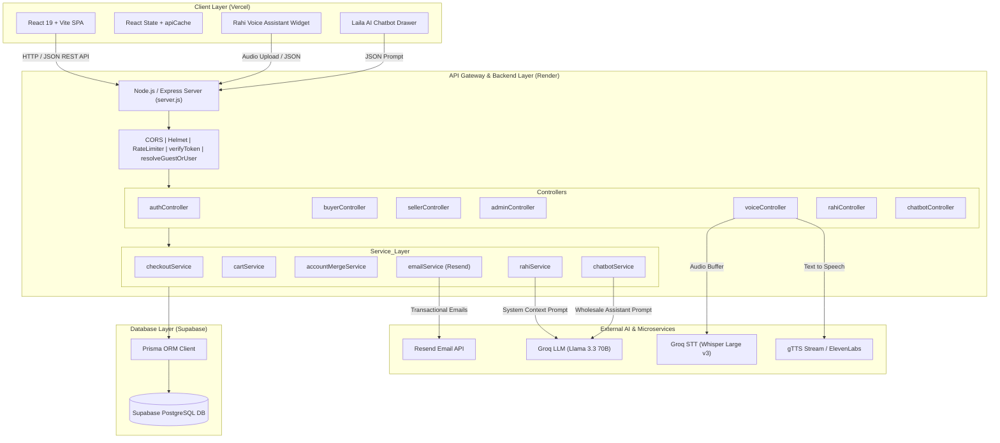
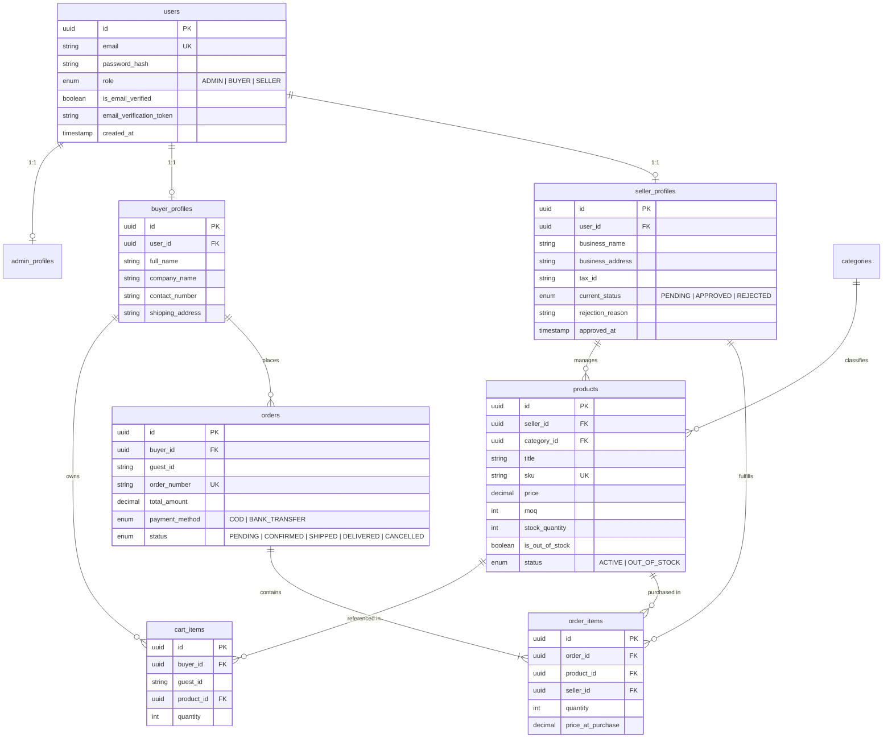
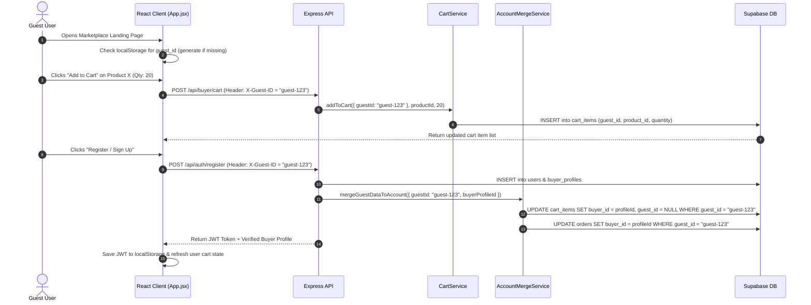
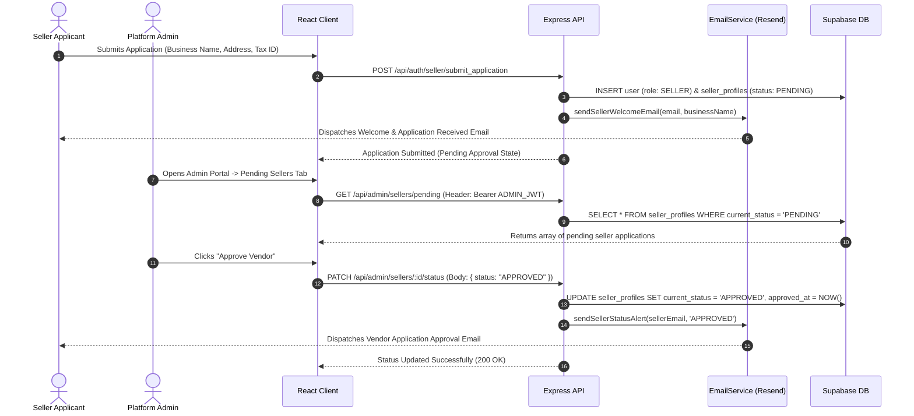

# LainDain System Architecture & Technical Overview (MVP v1)

> **System Architecture and Technical Overview**
> **Version:** 1.0.0
> **Status:** MVP v1

---

## 1. Executive Summary & System Overview

### 1.1 Product Purpose

**LainDain** is a B2B wholesale marketplace that connects textile sellers with retail buyers. The MVP provides product browsing, seller onboarding, inventory management, cart and checkout flows, order tracking, and admin management. It also includes AI based voice and chat assistants to help users interact with the platform.

Wholesale buying in areas such as Faisalabad, Lahore, and Karachi is still often handled through manual orders, phone calls, informal negotiations, and different MOQ requirements from one seller to another. LainDain brings these activities into one digital platform where buyers can browse standardized product listings, check MOQs and stock, place orders through a guest or registered account, and sellers can go through a structured KYC process. The platform also includes voice and chat based AI assistants to help users with product discovery and other common wholesale queries.

### 1.2 Target User Personas & System Roles

The system enforces strict Role-Based Access Control (RBAC) across three primary user roles, along with an unauthenticated Guest session mode:

| Role       | User Type                    | Core Capabilities & Permissions                                                                                                                                                           |
| :--------- | :--------------------------- | :---------------------------------------------------------------------------------------------------------------------------------------------------------------------------------------- |
| **Guest**  | Unauthenticated user         | Browse products, search and filter the catalog, add products to a guest cart, and complete checkout. The guest cart can be linked to the user's account after registration or login.      |
| **Buyer**  | Retail shop owner            | Create and verify an account through email OTP, browse and search products, manage the cart, place orders using COD or bank transfer, view order history, and manage profile information. |
| **Seller** | Wholesaler or textile vendor | Submit a seller application, provide KYC information, manage products and stock, maintain product listings, and manage order fulfillment.                                                 |
| **Admin**  | Platform administrator       | View platform metrics, review and approve or reject seller applications, receive seller status notifications, manage the product catalog, and view seller and buyer information.          |

---

## 2. High-Level Architecture Diagram

LainDain is structured as a monorepo with separate frontend and backend applications. The frontend is a React single page application built with Vite and hosted on Vercel. The backend is a Node.js and Express REST API hosted on Render. The backend uses Prisma to communicate with the PostgreSQL database hosted on Supabase. The system also connects to external services for AI processing, voice features, and transactional emails.



---

## 3. Technology Stack Specification

| Architecture Layer          | Technology / Library               | Version / Details                    | Purpose / Function in System                                      |
| :-------------------------- | :--------------------------------- | :----------------------------------- | :---------------------------------------------------------------- |
| **Frontend Framework**      | React                              | `^19.0.0`                            | Core UI component framework rendering SPA interface               |
| **Build Tooling**           | Vite                               | `^6.2.0`                             | High-performance ES module bundler & dev server                   |
| **Styling & Design System** | Vanilla CSS + Tailwind CSS         | Custom CSS Tokens + Tailwind`^4.0.0` | Responsive layout, dark mode aesthetic, glassmorphism UI          |
| **Icons & Visuals**         | Lucide React                       | `^1.16.0`                            | UI icons for navigation, dashboard tabs, and audio controls       |
| **Backend Runtime**         | Node.js                            | `>= 18.x`                            | JavaScript server execution environment                           |
| **API Web Framework**       | Express.js                         | `^4.21.2`                            | RESTful API routing, middleware chaining, HTTP request handling   |
| **Database & Storage**      | Supabase PostgreSQL                | Remote Cloud Instance                | Relational database hosting user accounts, products, orders, cart |
| **ORM / Data Access**       | Prisma                             | `^6.4.1`                             | Type-safe schema migration and client data access layer           |
| **Authentication**          | JSON Web Tokens (`jsonwebtoken`)   | `^9.0.2`                             | Stateless bearer token session management                         |
| **Password Security**       | `bcryptjs`                         | `^3.0.2`                             | Salted password hashing (10 salt rounds)                          |
| **Security Middleware**     | `helmet` + `cors`                  | `^8.0.0` / `^2.8.5`                  | HTTP header security hardening and cross-origin resource sharing  |
| **Rate Limiting**           | `express-rate-limit`               | `^7.5.0`                             | DDoS protection & API abuse prevention on auth & AI endpoints     |
| **Speech-to-Text (STT)**    | Groq SDK (`groq-sdk`)              | `whisper-large-v3`                   | High-speed multilingual voice transcription (Urdu / English)      |
| **LLM Inference Engine**    | Groq SDK (`groq-sdk`)              | `llama-3.3-70b-versatile`            | Ultra-low latency voice & chatbot intent processing               |
| **Text-to-Speech (TTS)**    | Google Translate gTTS / ElevenLabs | HTTP Stream Fallback                 | Audio stream synthesis for spoken responses                       |
| **Transactional Email**     | Resend API (`resend`)              | `^4.1.2`                             | OTP verification codes, seller welcome, status alert emails       |
| **Frontend Hosting**        | Vercel                             | SPA Rewrites                         | Global edge CDN deployment for React client app                   |
| **Backend Hosting**         | Render                             | Node.js Web Service                  | Cloud server deployment for Express REST API                      |

---

## 4. Frontend Architecture (`/client`)

### 4.1 Component Architecture & Layout Hierarchy

The client application is organized as a modular React single-page application entry-pointed in `client/src/App.jsx`.

```
client/src/
├── components/
│   ├── AdminDashboard.jsx    # Admin metrics, seller approvals, directory & catalog tables
│   ├── CartModal.jsx         # Buyer shopping cart drawer with quantity adjustments
│   ├── CheckoutModal.jsx     # Order completion form (COD / Bank Transfer)
│   ├── Footer.jsx            # Platform footer with category links & trust badges
│   ├── LailaChatbot.jsx      # Text-based wholesale customer service AI drawer
│   ├── Navbar.jsx            # Main navigation header with search bar & auth triggers
│   ├── OrderHistoryModal.jsx # Buyer order tracking & status list
│   ├── ProductCard.jsx       # Individual wholesale product card with MOQ & Stock tags
│   ├── ProductDetailModal.js # Full product specifications & direct add-to-cart
│   ├── RahiWidget.jsx        # Floating voice assistant with live listening wave
│   └── SellerDashboard.jsx   # Seller catalog management, stock toggles & KYC status
├── services/
│   └── api.js                # Centralized fetch wrapper & client-side response cache
├── App.jsx                   # Primary state controller, layout & modal orchestration
├── index.css                 # Global CSS variables, custom utilities & dark aesthetic
└── main.jsx                  # React DOM root entry point
```

### 4.2 Application State & Caching Strategy

The frontend uses React `useState` to manage local UI state such as active tabs, cart visibility, modal states, and voice interaction states. API requests are handled through `client/src/services/api.js`, which also maintains an in-memory `apiCache` for frequently requested data. This helps avoid repeated API requests when users switch between dashboard sections.

- **Cache Keys:** `summary`, `pendingSellers`, `allSellers`, `buyers`, `adminProducts`, `sellerProducts`, `sellerKyc`
- **Cache Invalidation:** Cached data is cleared after relevant write operations, such as updating seller status, creating a product, or changing stock levels.
- **Fallback:** If an API request fails, `App.jsx` can fall back to the static `SAMPLE_PRODUCTS` data for the catalog. This is mainly useful during development and demos when the backend is unavailable.

### 4.3 Guest Session & Dual Identity Tracking

LainDain allows users to browse products and manage a cart without creating an account first. Guest sessions are identified using a locally stored `guest_id`, which allows the backend to associate cart activity with the same guest across requests.

1. **Guest ID Generation:** When the application starts, `App.jsx` checks `localStorage` for `laindain_guest_id`. If it does not exist, the application generates a unique guest ID and stores it locally.
2. **Request Header:** API requests made through `services/api.js` include the guest ID using the `X-Guest-ID` header.
3. **Account Linking:** When a guest registers or logs into a Buyer account, the guest ID is passed to the backend. The backend can then associate the guest's existing cart and order data with the Buyer account.

---

## 5. Backend Architecture (`/server`)

### 5.1 Entry Point & Middleware Chain (`server.js`)

The server application is built on Express.js, configured in `server/src/server.js`. The HTTP request pipeline flows sequentially through global security middlewares before reaching domain routes:

```
[ Incoming Request ]
        │
        ▼
[ Helmet (HTTP Hardening) ]
        │
        ▼
[ CORS (Allowed Origins Control) ]
        │
        ▼
[ express.json() & express.urlencoded() (Payload Parsing) ]
        │
        ▼
[ Rate Limiters (Auth & AI Limits) ]
        │
        ▼
[ Route Handler Matching (/api/*) ]
        │
        ▼
[ Auth & Context Middlewares (verifyToken / resolveGuestOrUser) ]
        │
        ▼
[ Controller Execution ] ──> [ Database Access via Supabase/Prisma ]
        │
        ▼
[ JSON Response Output / Error Handler ]
```

### 5.2 Endpoint & Route Mapping

| Route Namespace     | HTTP Verb | Endpoint Path                | Middleware Guards           | Description / Controller Action                                      |
| :------------------ | :-------- | :--------------------------- | :-------------------------- | :------------------------------------------------------------------- |
| **`/api/auth`**     | `POST`    | `/register`                  | Auth Rate Limiter           | Creates User + Profile (Buyer/Seller/Admin), dispatches OTP code     |
|                     | `POST`    | `/verify-email`              | Auth Rate Limiter           | Verifies 6-digit OTP code, sets`is_email_verified = true`            |
|                     | `POST`    | `/login`                     | Auth Rate Limiter           | Validates credentials, returns JWT token + user profile              |
|                     | `POST`    | `/seller/submit_application` | Auth Rate Limiter           | Submits seller application for admin review                          |
| **`/api/products`** | `GET`     | `/`                          | Public                      | Lists approved wholesale products (supports category & search query) |
|                     | `GET`     | `/:id`                       | Public                      | Returns detailed specs for a single product                          |
|                     | `GET`     | `/categories`                | Public                      | Retrieves all active wholesale product categories                    |
|                     | `POST`    | `/`                          | `verifyToken`               | Creates a new product persisted in Supabase                          |
|                     | `PATCH`   | `/:id`                       | `verifyToken`               | Updates product details or category associations                     |
|                     | `DELETE`  | `/:id`                       | `verifyToken`               | Deletes a product entry                                              |
| **`/api/buyer`**    | `GET`     | `/profile`                   | `verifyToken`               | Retrieves buyer profile details                                      |
|                     | `PUT`     | `/profile`                   | `verifyToken`               | Updates buyer profile address & phone                                |
|                     | `GET`     | `/cart`                      | `resolveGuestOrUser`        | Retrieves buyer or guest cart contents                               |
|                     | `POST`    | `/cart`                      | `resolveGuestOrUser`        | Adds product item to buyer/guest cart                                |
|                     | `PATCH`   | `/cart/:id`                  | `resolveGuestOrUser`        | Updates item quantity in cart                                        |
|                     | `DELETE`  | `/cart/:id`                  | `resolveGuestOrUser`        | Removes item from cart                                               |
|                     | `POST`    | `/checkout`                  | `resolveGuestOrUser`        | Executes transactional checkout (COD / Bank Transfer)                |
| **`/api/seller`**   | `GET`     | `/kyc`                       | `verifyToken`, `sellerAuth` | Fetches seller profile & KYC verification status                     |
|                     | `POST`    | `/kyc`                       | `verifyToken`, `sellerAuth` | Uploads seller verification documents                                |
|                     | `GET`     | `/products`                  | `verifyToken`, `sellerAuth` | Fetches products owned**strictly** by authenticated seller           |
|                     | `POST`    | `/products`                  | `verifyToken`, `sellerAuth` | Creates new product tied to seller ID                                |
|                     | `PATCH`   | `/products/:id/stock`        | `verifyToken`, `sellerAuth` | Updates stock quantity & out-of-stock state                          |
| **`/api/admin`**    | `GET`     | `/summary`                   | `verifyToken`, `adminAuth`  | Returns dynamic platform metrics & top sellers                       |
|                     | `GET`     | `/sellers/pending`           | `verifyToken`, `adminAuth`  | Lists pending seller applications for review                         |
|                     | `PATCH`   | `/sellers/:id/status`        | `verifyToken`, `adminAuth`  | Approves/Rejects seller application + triggers alert email           |
|                     | `GET`     | `/sellers/all`               | `verifyToken`, `adminAuth`  | Directory of all registered sellers & total revenues                 |
|                     | `GET`     | `/buyers`                    | `verifyToken`, `adminAuth`  | Directory of all active buyers & total order volumes                 |
|                     | `GET`     | `/products`                  | `verifyToken`, `adminAuth`  | Catalog-wide product list across all sellers                         |
| **`/api/voice`**    | `POST`    | `/transcribe`                | Voice Rate Limiter          | Uploads audio buffer -> Groq Whisper STT transcription               |
|                     | `POST`    | `/speak`                     | Voice Rate Limiter          | Synthesizes speech stream via gTTS / ElevenLabs                      |
| **`/api/rahi`**     | `POST`    | `/message`                   | Voice Rate Limiter          | Processes Rahi voice context prompt -> returns LLM response          |
| **`/api/chatbot`**  | `POST`    | `/message`                   | Chat Rate Limiter           | Processes Laila chatbot prompt -> returns text response              |

---

## 6. Authentication & Security Architecture

### 6.1 Token Lifecycle & Payload

Authentication uses JSON Web Tokens (JWT) issued upon successful login or registration.

- **Expiration:** 24 hours (`expiresIn: '24h'`).
- **Signature Algorithm:** HMAC SHA-256 using `JWT_SECRET`.
- **JWT Payload Structure:**

```json
{
  "id": "uuid-user-id",
  "email": "buyer@example.com",
  "role": "BUYER",
  "profile_id": "uuid-buyer-profile-id",
  "iat": 1740000000,
  "exp": 1740086400
}
```

### 6.2 Role-Based Middleware Protection

Access to role-restricted endpoints is enforced by chained middleware functions:

1. `verifyToken`: Extracts `Authorization: Bearer <token>` header, verifies signature, and populates `req.user`.
2. `sellerAuth`: Verifies `req.user.role === 'SELLER'` or confirms existing `seller_profiles` entry.
3. `adminAuth`: Enforces `req.user.role === 'ADMIN'`, rejecting unauthorized access with HTTP `403 Forbidden`.

```
[ Incoming Request to /api/admin/* ]
                │
                ▼
        [ verifyToken ] ──(Invalid / Missing)──> [ 401 Unauthorized ]
                │ (Valid Token)
                ▼
        [ adminAuth ] ───(Role != ADMIN)──────> [ 403 Forbidden ]
                │ (Role == ADMIN)
                ▼
      [ Execute Controller ]
```

### 6.3 Dual Session Resolution (`resolveGuestOrUser`)

For shopping cart and checkout endpoints, `resolveGuestOrUser` middleware evaluates both authenticated users and anonymous guests without rejecting requests:

- If a valid JWT is present: `req.user` is populated, `req.isGuest = false`, and `req.guestId = null`.
- If JWT is absent: `req.user = null`, `req.isGuest = true`, and `req.guestId` is extracted from `X-Guest-ID` / `X-Guest-Token` headers.

### 6.4 Account Merge Pipeline (`AccountMergeService`)

When an anonymous guest converts by registering or logging into a Buyer account:

1. `authController` extracts `incomingGuestId` from request headers.
2. `AccountMergeService.mergeGuestDataToAccount()` is triggered asynchronously.
3. **Cart Items Merge:** Unassigned cart items matching `guest_id` are re-assigned to the user's `buyer_profile_id`. Duplicate items are merged by summing quantities.
4. **Orders Merge:** Past guest orders matching `guest_id` or matching buyer phone/email are linked to `buyer_profile_id`.

---

## 7. Database Entity Relationship Model (Supabase / Prisma)

The entity relational model is defined in `server/prisma/schema.prisma` and mirrored in PostgreSQL on Supabase.



---

## 8. AI & Voice Assistant Architecture

LainDain features two dedicated AI interaction engines built on the **Groq Llama-3.3 70B** model and **Groq Whisper Large v3** STT engine:

```
[ User Microphone Input ]
          │
          ▼
[ Audio WebM Blob ] ──> [ POST /api/voice/transcribe ] ──> [ Groq Whisper STT ]
                                                                   │
                                                            (Transcribed Text)
                                                                   │
[ User Screen Context ] ───────────────────────────────────────────┤
                                                                   ▼
[ System Wholesale Prompt ] ──> [ POST /api/rahi/message ] ──> [ Groq Llama-3.3 70B ]
                                                                   │
                                                          (JSON Response Payload)
                                                                   │
[ Audio Synthesis ] <── [ POST /api/voice/speak ] <──────────────┤
         │                                                         ▼
         └─────────────────────────────────────────────> [ React UI Action Execution ]
```

### 8.1 Rahi Multilingual Voice Assistant Pipeline

- **Role:** Rahi is the voice assistant for LainDain and supports interactions in English and Urdu.
- **Audio Capture and Transcription (`voiceController.js`):** Audio recorded in the browser is sent to `/api/voice/transcribe` as `multipart/form-data`. The server checks the uploaded file type and size before sending the audio to Groq Whisper for transcription. The currently supported audio formats are `webm`, `wav`, `mp3`, and `m4a`, with a maximum file size of 10 MB.
- **Context and Response Processing (`rahiService.js`):** The transcribed text is sent to `/api/rahi/message` along with the current page context, such as `"BUYER_CATALOG"` or `"CART_DRAWER"`. The Llama 3.3 70B model processes the request and returns a structured response containing the assistant's reply and any suggested actions for the frontend.
- `reply`: The response that is shown or spoken to the user.
- `suggested_actions`: Predefined actions that can be used by the frontend, such as `SEARCH_PRODUCT`, `ADD_TO_CART`, or `NAVIGATE_PAGE`.
- **Speech Synthesis (`voiceController.js`):** The generated response is converted to speech using Google gTTS by default, with ElevenLabs available when `TTS_API_KEY` is configured. If the external TTS service fails, the endpoint returns a fallback response and the browser can use its built-in `window.speechSynthesis` functionality.

### 8.2 Laila Customer Service Chatbot (`chatbotService.js`)

- **Role:** Laila is the text-based assistant embedded in `LailaChatbot.jsx`.
- **Functionality:** Laila helps users with common wholesale related questions, including MOQs, bulk shipping, payment methods, seller onboarding, and catalog navigation.
- **Input and Conversation Handling:** User input is sanitized and limited to 500 characters. The conversation history is limited to the last 6 turns to keep the amount of context sent to the model manageable and within the configured token limits.

---

## 9. End-to-End Data Workflows

### 9.1 Sequence: Guest Browsing, Shopping Cart & Account Merge



### 9.2 Sequence: Seller Registration & Admin Approval Workflow



---

## 10. Deployment & Environment Configuration

### 10.1 Production Hosting Architecture

- **Frontend (Vercel):** Configured via `vercel.json` to route all single-page application paths to `index.html`:
  ```json
  {
    "rewrites": [{ "source": "/(.*)", "destination": "/index.html" }]
  }
  ```
- **Backend (Render):** Configured via `render.yaml` as a Node.js web service running `npm install` and `npm start`.

### 10.2 Environment Variable Matrix

| Variable Name               | Required     | Scope  | Description & Purpose                                           |
| :-------------------------- | :----------- | :----- | :-------------------------------------------------------------- |
| `NODE_ENV`                  | Optional     | Server | Runtime mode (`development` or `production`)                    |
| `PORT`                      | Optional     | Server | HTTP server port (Default:`5000`)                               |
| `SUPABASE_URL`              | **Required** | Server | Supabase project HTTP API URL                                   |
| `SUPABASE_SERVICE_ROLE_KEY` | **Required** | Server | Supabase service role secret key (bypasses RLS for backend ops) |
| `DATABASE_URL`              | **Required** | Server | Direct PostgreSQL connection string for Prisma ORM              |
| `DIRECT_URL`                | **Required** | Server | Supabase direct DB connection URL for migrations                |
| `JWT_SECRET`                | **Required** | Server | Secret string used to sign and verify JWT authentication tokens |
| `GROQ_API_KEY_RAHI`         | **Required** | Server | Primary Groq API Key for Rahi Llama-3.3 70B LLM inference       |
| `GROQ_API_KEY_STT`          | **Required** | Server | Dedicated Groq API Key for Whisper audio transcription          |
| `RESEND_API_KEY`            | Optional     | Server | Resend API Key for sending transactional email alerts           |
| `RESEND_FROM_EMAIL`         | Optional     | Server | Verified sender email address for Resend                        |
| `TTS_PROVIDER`              | Optional     | Server | Speech synthesis provider (`gtts` or `elevenlabs`)              |
| `TTS_API_KEY`               | Optional     | Server | API Key for ElevenLabs TTS (if provider is set to elevenlabs)   |
| `VITE_API_URL`              | Optional     | Client | Base backend REST API URL for client fetch requests             |

---

## 11. Feature Implementation Matrix

| Module / Feature       | Sub-Feature                    | Implementation Status | Implementation Details                                         |
| :--------------------- | :----------------------------- | :-------------------- | :------------------------------------------------------------- |
| **Authentication**     | Email & Password Registration  | **Fully Implemented** | Hashes passwords with`bcryptjs`, creates DB records            |
|                        | 6-Digit OTP Email Verification | **Fully Implemented** | OTP generated, dispatched via Resend, validated in DB          |
|                        | Role-Based Access (RBAC)       | **Fully Implemented** | JWT middleware enforces`BUYER`, `SELLER`, `ADMIN` permissions  |
|                        | Account Merge (Guest -> User)  | **Fully Implemented** | Transfers guest carts & guest orders to new/logged-in user     |
| **Catalog & Products** | Multi-Tenant Vendor Listings   | **Fully Implemented** | Products strictly linked to`seller_id` in Supabase             |
|                        | MOQ & Stock Enforcement        | **Fully Implemented** | Products enforce Minimum Order Quantities & stock levels       |
|                        | Category Filter & Search       | **Fully Implemented** | Public catalog supports real-time text & category filtering    |
| **Buyer Workflow**     | Guest Shopping Cart            | **Fully Implemented** | Local`guest_id` header tracking with cart persistence          |
|                        | Checkout (COD & Bank Transfer) | **Fully Implemented** | Order creation, stock deduction, guest or buyer linkage        |
|                        | Order History Tracking         | **Fully Implemented** | Buyers can view past order statuses & item breakdowns          |
| **Seller Dashboard**   | Stock & Availability Toggles   | **Fully Implemented** | Real-time stock quantity adjustments & out-of-stock state      |
|                        | KYC Document Submission        | **Fully Implemented** | Upload document status tracking (`Pending Verification`)       |
|                        | Product Creation & Editing     | **Fully Implemented** | Creates wholesale listings directly tied to seller profile     |
| **Admin Portal**       | Dynamic Summary Metrics        | **Fully Implemented** | Dynamic total sales, top sellers, and active buyer volume      |
|                        | Vendor Verification System     | **Fully Implemented** | Approves/Rejects seller applications + automated email alerts  |
|                        | Platform Catalog Oversight     | **Fully Implemented** | Catalog-wide product inspection across all vendors             |
| **AI Assistants**      | Groq Whisper Audio STT         | **Fully Implemented** | Multilingual audio transcription with MIME validation          |
|                        | Rahi Conversational Assistant  | **Fully Implemented** | Llama-3.3 70B structured JSON responses & screen context       |
|                        | Multi-Tier TTS Voice Stream    | **Fully Implemented** | gTTS server streaming with Web Speech browser fallback         |
|                        | Laila Customer Service Bot     | **Fully Implemented** | Wholesale Q&A chatbot with conversation history limits         |
| **Roadmap (v2)**       | Escrow Payment Gateway         | _Planned (v2)_        | Integration with online payment providers (JazzCash/Easypaisa) |
|                        | Real-Time Logistics Tracking   | _Planned (v2)_        | Third-party courier API tracking integration                   |

---

## 12. Security & Architectural Recommendations

The current MVP includes several security measures such as JWT based authentication, password hashing, request rate limiting, input sanitization, and protected backend routes. The following points are recommendations for improving the system as it moves beyond MVP v1.

1. **Separate API Keys:** Keep separate Groq API keys for speech-to-text (`GROQ_API_KEY_STT`) and LLM processing (`GROQ_API_KEY_RAHI`). This keeps the two workloads independent and makes it easier to manage their usage and limits.
2. **Database Row Level Security:** The backend currently uses the Supabase service role key for database operations. RLS policies should also be configured on the relevant Supabase tables as an additional layer of protection, especially if any direct database access is introduced later.
3. **Input Sanitization:** User input and text passed to the TTS layer are sanitized before processing. The existing `sanitizeTextForSpeech` utility removes HTML tags and markdown characters from text before it is sent to the speech service. This should continue to be applied consistently to user generated content.
4. **JWT Refresh Strategy:** The current JWT tokens have a 24 hour expiration period. For a future production release, the authentication flow could be updated to use shorter lived access tokens, for example 15 minutes, together with a secure HTTP only refresh cookie. This would reduce the impact of a stolen access token.
