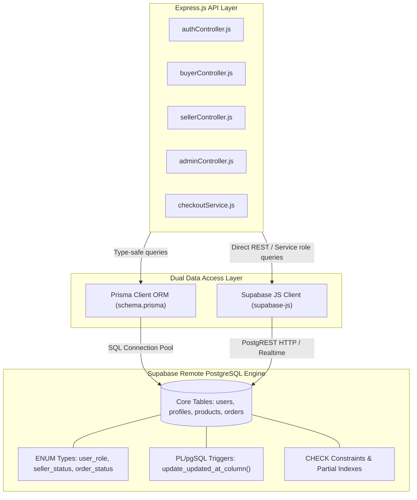
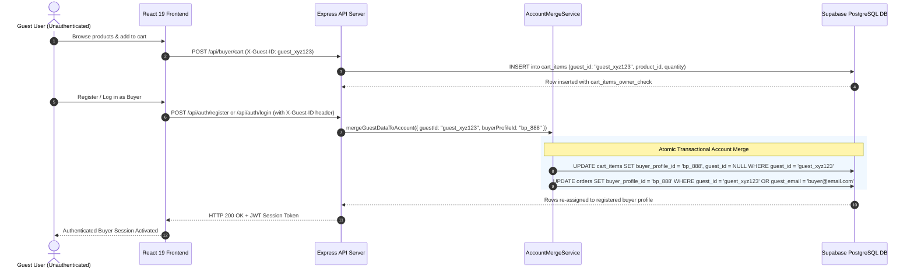
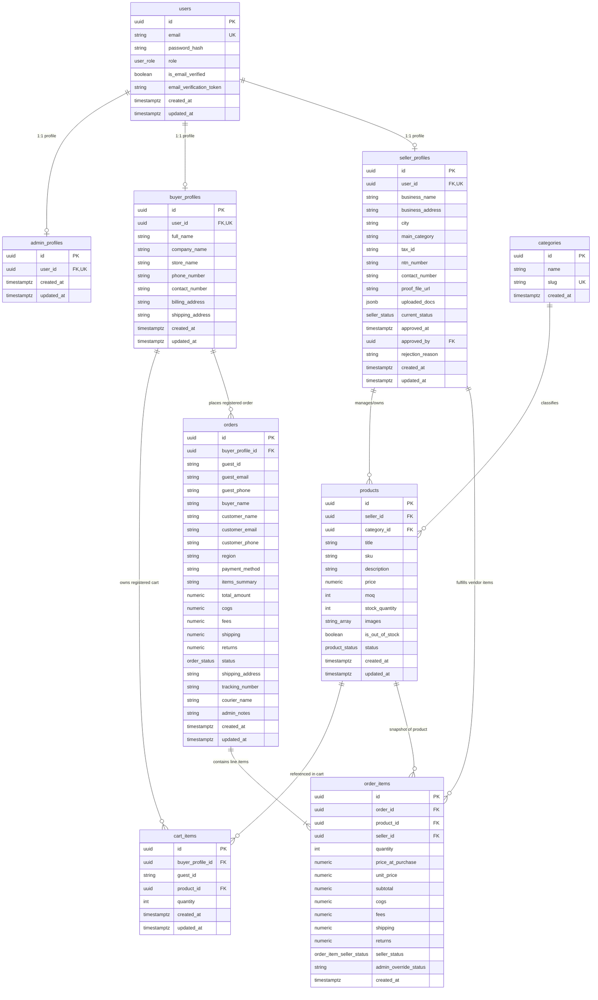
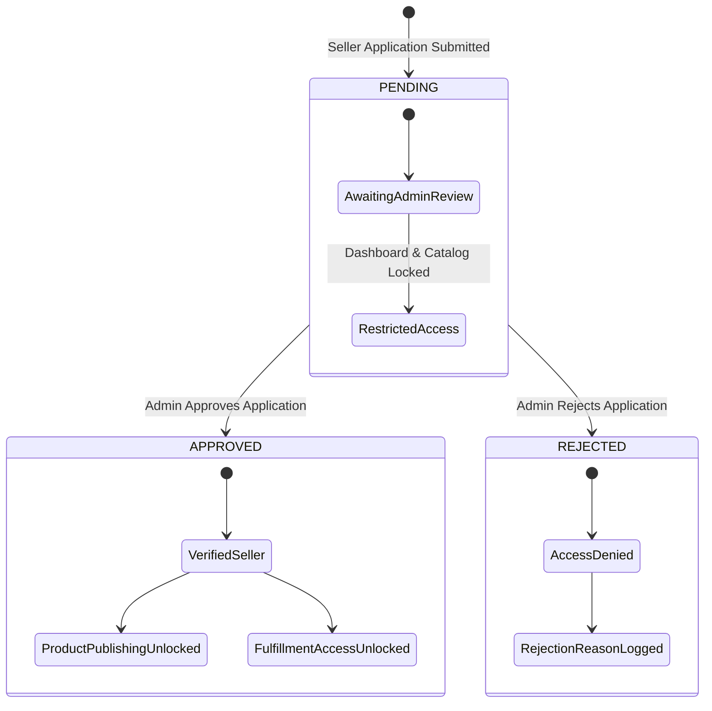
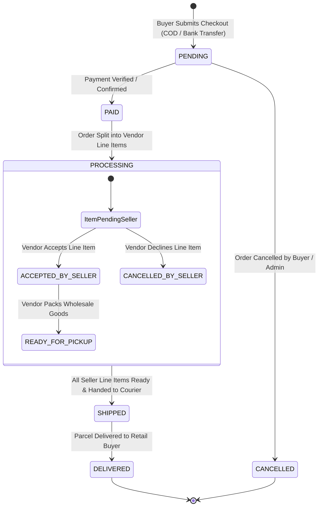

# LainDain Data Architecture & Data Model Documentation (MVP v1)

> **Database & Data Model Specification**  
> **Version:** 1.0.0  
> **Status:** Production / MVP v1  
> **Target Database Engine:** PostgreSQL 15+ (Remote Supabase Cloud Cluster)  
> **Data Access Layers:** Prisma ORM Client (`^6.4.1`) & Native Supabase JavaScript Client (`^2.49.1`)  

---

## 1. Executive Summary & Data Architecture Overview

### 1.1 Data Layer Architecture & Multi-Tenant Paradigm

**LainDain** operates a B2B multi-vendor wholesale trade platform designed for textile manufacturers, wholesalers, and retail buyers across Pakistan (specifically key industrial hubs such as Faisalabad, Lahore, Karachi, and Sialkot).

The underlying data architecture is built on a **relational multi-tenant paradigm** hosted on Supabase PostgreSQL. It separates core user authentication (`users`) from domain-specific profiles (`admin_profiles`, `buyer_profiles`, `seller_profiles`). This decoupling ensures strict security isolation, predictable query performance, and straightforward data governance.

```
                  ┌────────────────────────┐
                  │      public.users      │
                  └───────────┬────────────┘
                              │ 1:1
        ┌─────────────────────┼─────────────────────┐
        │ 1:1                 │ 1:1                 │ 1:1
┌───────▼────────┐   ┌────────▼───────┐   ┌─────────▼────────┐
│ admin_profiles │   │ buyer_profiles │   │ seller_profiles  │
└────────────────┘   └───────┬────────┘   └─────────┬────────┘
                             │                      │
                   1:N       │                      │ 1:N
             ┌───────────────┴────┐        ┌────────┴────────┐
             │ public.cart_items  │        │ public.products │
             └────────────────────┘        └────────┬────────┘
                             │                      │
                   1:N       │                      │ 1:N
             ┌───────────────▼────┐        ┌────────▼────────┐
             │   public.orders    │◄───────┤  order_items    │
             └────────────────────┘  1:N   └─────────────────┘
```

### 1.2 Dual-ORM & Migration Strategy

The data infrastructure uses a hybrid access model:
1. **Prisma ORM (`server/prisma/schema.prisma`):** Provides a declarative, type-safe interface for database model definitions, automated TypeScript/JS code generation, and structured schema evolution.
2. **Supabase DDL SQL Migrations (`server/supabase/migrations/`):** Contains incremental, version-controlled raw SQL scripts executed directly against PostgreSQL. These migration scripts manage extensions (`uuid-ossp`, `pgcrypto`), custom PL/pgSQL triggers, role-based table grants (`anon`, `authenticated`, `service_role`), check constraints, and performance indexes.



### 1.3 Guest Session vs. Authenticated User Identity Persistence

To reduce buyer friction, LainDain allows unauthenticated users ("Guests") to browse standardized wholesale catalogs, add items with strict Minimum Order Quantities (MOQs) to a shopping cart, and initiate guest checkout.

Identity persistence is managed through a **hybrid identity key mechanism**:
* **Cart Persistence:** Table `cart_items` features an owner check constraint (`cart_items_owner_check`) requiring either `buyer_profile_id IS NOT NULL` OR `guest_id IS NOT NULL`.
* **Order Tracking:** Table `orders` enforces `orders_buyer_check`, allowing order placement via `buyer_profile_id`, `guest_id`, or `guest_email`.
* **Account Merging:** Upon user registration or login, `AccountMergeService` executes atomic transaction queries to transfer all orphan `guest_id` cart items and historical orders to the newly established `buyer_profile_id`.



### 1.4 Financial Integrity & Decimal Precision Controls

All monetary values (`price`, `total_amount`, `price_at_purchase`, `cogs`, `fees`, `shipping`, `returns`) are defined using fixed-precision decimal numeric types in PostgreSQL (`NUMERIC(12, 2)` or `@db.Decimal(12, 2)` in Prisma). This eliminates floating-point rounding errors during multi-vendor split-order calculations and platform fee deductions.

---

## 2. Entity-Relationship Diagram (ERD)

The diagram below illustrates all core database tables, primary/foreign keys, and relational cardinalities in the LainDain backend database schema:



---

## 3. Core Database ENUM Types & Lifecycle State Machines

PostgreSQL ENUM types ensure strict data domain validation at the database engine level.

### 3.1 `user_role`
Defines system access boundaries and role-based middleware routing rules.

| Value | System Context & Authorization Scope |
| :--- | :--- |
| `ADMIN` | Full access to platform metrics, seller verification approvals, global buyer/seller directories, and catalog controls. |
| `BUYER` | Wholesale retail buyer access to cart management, checkout execution, order tracking history, and account profile settings. |
| `SELLER` | Textile manufacturer or wholesale vendor access to inventory CRUD, stock level toggles, and multi-vendor order fulfillment workflows. |

### 3.2 `seller_status`
Tracks the Know Your Customer (KYC) onboarding pipeline for wholesale vendors.

| Value | Business Meaning & System Behavior |
| :--- | :--- |
| `PENDING` | Default state upon seller application. Vendor dashboard access is restricted until approved by an Admin. |
| `APPROVED` | Verified vendor state. Unlocks full seller dashboard access, product publishing, and order fulfillment capabilities. |
| `REJECTED` | Denied vendor state. Restricts seller dashboard access and records an audit rejection reason. |



### 3.3 `product_status`
Controls visibility and purchasing rules for product listings in the marketplace.

| Value | Lifecycle Description & Visibility Rules |
| :--- | :--- |
| `DRAFT` | Initial unpublished state created by seller; hidden from buyer catalog search. |
| `APPROVED` | Product listing verified and authorized for public marketplace display. |
| `ACTIVE` | Default published state. Product is actively visible and purchasable by buyers. |
| `OUT_OF_STOCK` | Stock count is `0` or manually disabled; visible in catalog with disabled cart button. |

### 3.4 `order_status`
Manages the lifecycle of a buyer's order.

| Value | Workflow Description |
| :--- | :--- |
| `PENDING` | Default initial order status upon checkout submission (Cash on Delivery / Bank Transfer pending). |
| `GUEST_CHECKOUT_PENDING` | Order submitted by an unauthenticated guest user awaiting processing or account link. |
| `PAID` | Payment confirmed via bank transfer verification or gateway confirmation. |
| `PROCESSING` | Order acknowledged by sellers and currently being packed or assembled. |
| `SHIPPED` | Consignment handed over to courier service; tracking number attached. |
| `DELIVERED` | Consignment delivered to buyer's shipping address; order complete. |
| `CANCELLED` | Order terminated by buyer, seller, or platform administrator. |

### 3.5 `order_item_seller_status`
Enables independent vendor fulfillment tracking for multi-vendor split orders.

| Value | Fulfillment Progress Meaning |
| :--- | :--- |
| `PENDING` | Vendor has received line item notification; awaiting seller acceptance. |
| `ACCEPTED_BY_SELLER` | Vendor has confirmed stock availability and accepted order responsibility. |
| `READY_FOR_PICKUP` | Vendor has packed wholesale goods; ready for platform logistics collection. |
| `CANCELLED` | Vendor has declined line item due to stock deficit or operational constraints. |



---

## 4. Comprehensive Schema Reference & Table Specifications

---

### 4.1 Authentication & Identity Domain

#### 4.1.1 `users` Table
Stores core authentication accounts and global system credentials.

* **Primary Key:** `id` (`UUID`)
* **Indexes:** `idx_users_email` (`UNIQUE`)

| Column Name | PostgreSQL Data Type | Constraints | Description / Business Logic |
| :--- | :--- | :--- | :--- |
| `id` | `UUID` | `PRIMARY KEY`, `DEFAULT gen_random_uuid()` | Unique immutable surrogate identifier. |
| `email` | `TEXT` | `UNIQUE`, `NOT NULL` | User email address used for login and notifications. |
| `password_hash` | `TEXT` | `NOT NULL` | Salted password hash produced by `bcryptjs` (10 rounds). |
| `role` | `user_role` | `NOT NULL`, `DEFAULT 'BUYER'` | User role (`ADMIN`, `BUYER`, `SELLER`). |
| `is_email_verified` | `BOOLEAN` | `NOT NULL`, `DEFAULT FALSE` | Email OTP verification status flag. |
| `email_verification_token` | `TEXT` | `NULLABLE` | Temporary 6-digit numeric OTP code for email verification. |
| `created_at` | `TIMESTAMPTZ` | `NOT NULL`, `DEFAULT NOW()` | ISO timestamp when account was registered. |
| `updated_at` | `TIMESTAMPTZ` | `NOT NULL`, `DEFAULT NOW()` | Timestamp of last user modifications. Updated via trigger. |

---

#### 4.1.2 `admin_profiles` Table
Stores administrative user metadata.

* **Primary Key:** `id` (`UUID`)
* **Foreign Keys:** `user_id` -> `users(id)` (`ON DELETE CASCADE`)
* **Indexes:** `idx_admin_user_id` (`UNIQUE`)

| Column Name | PostgreSQL Data Type | Constraints | Description / Business Logic |
| :--- | :--- | :--- | :--- |
| `id` | `UUID` | `PRIMARY KEY`, `DEFAULT gen_random_uuid()` | Unique profile identifier. |
| `user_id` | `UUID` | `UNIQUE`, `NOT NULL`, `FK -> users(id)` | Associated user account reference. |
| `created_at` | `TIMESTAMPTZ` | `NOT NULL`, `DEFAULT NOW()` | Timestamp of admin profile creation. |
| `updated_at` | `TIMESTAMPTZ` | `NOT NULL`, `DEFAULT NOW()` | Timestamp of last admin profile update. |

---

#### 4.1.3 `buyer_profiles` Table
Contains retail buyer commercial metadata, business store names, and shipping destinations.

* **Primary Key:** `id` (`UUID`)
* **Foreign Keys:** `user_id` -> `users(id)` (`ON DELETE CASCADE`)
* **Indexes:** `idx_buyer_user_id` (`UNIQUE`)

| Column Name | PostgreSQL Data Type | Constraints | Description / Business Logic |
| :--- | :--- | :--- | :--- |
| `id` | `UUID` | `PRIMARY KEY`, `DEFAULT gen_random_uuid()` | Unique buyer profile identifier. |
| `user_id` | `UUID` | `UNIQUE`, `NOT NULL`, `FK -> users(id)` | Parent user account link. |
| `full_name` | `TEXT` | `NULLABLE` | Primary buyer or retail store manager full name. |
| `company_name` | `TEXT` | `NULLABLE` | Registered retail business or company name. |
| `store_name` | `TEXT` | `NULLABLE` | Retail shop or outlet display name. |
| `phone_number` | `TEXT` | `NULLABLE` | Primary contact mobile number. |
| `contact_number` | `TEXT` | `NULLABLE` | Secondary or landline business phone number. |
| `shipping_address` | `TEXT` | `NULLABLE` | Default destination address for wholesale parcel delivery. |
| `billing_address` | `TEXT` | `NULLABLE` | Registered tax and invoice billing address. |
| `created_at` | `TIMESTAMPTZ` | `NOT NULL`, `DEFAULT NOW()` | Profile record creation timestamp. |
| `updated_at` | `TIMESTAMPTZ` | `NOT NULL`, `DEFAULT NOW()` | Timestamp of last profile update. Updated via trigger. |

---

#### 4.1.4 `seller_profiles` Table
Stores textile manufacturer and wholesale vendor profiles, tax registration details, and KYC approval states.

* **Primary Key:** `id` (`UUID`)
* **Foreign Keys:** `user_id` -> `users(id)` (`ON DELETE CASCADE`), `approved_by` -> `users(id)` (`ON DELETE SET NULL`)
* **Indexes:** `idx_seller_user_id` (`UNIQUE`), `idx_seller_status` (`current_status`)

| Column Name | PostgreSQL Data Type | Constraints | Description / Business Logic |
| :--- | :--- | :--- | :--- |
| `id` | `UUID` | `PRIMARY KEY`, `DEFAULT gen_random_uuid()` | Unique seller profile identifier. |
| `user_id` | `UUID` | `UNIQUE`, `NOT NULL`, `FK -> users(id)` | Parent user account reference. |
| `business_name` | `TEXT` | `NOT NULL` | Factory, mill, or wholesale company name. |
| `business_address` | `TEXT` | `NULLABLE` | Physical factory or warehouse address. |
| `city` | `TEXT` | `NULLABLE` | City of operation (e.g. Faisalabad, Lahore, Karachi). |
| `main_category` | `TEXT` | `NULLABLE` | Primary product focus area (e.g. Apparel & Textiles). |
| `tax_id` | `TEXT` | `NULLABLE` | Sales tax registration number (STRN). |
| `ntn_number` | `TEXT` | `NULLABLE` | National Tax Number (NTN) or CNIC identifier. |
| `contact_number` | `TEXT` | `NULLABLE` | Official factory sales office telephone number. |
| `proof_file_url` | `TEXT` | `NULLABLE` | URL of uploaded NTN certificate or visiting card document. |
| `uploaded_docs` | `JSONB` | `DEFAULT '[]'::jsonb` | JSON array storing uploaded document metadata. |
| `current_status` | `seller_status` | `NOT NULL`, `DEFAULT 'PENDING'` | KYC approval status (`PENDING`, `APPROVED`, `REJECTED`). |
| `approved_at` | `TIMESTAMPTZ` | `NULLABLE` | Timestamp when Admin approved the application. |
| `approved_by` | `UUID` | `NULLABLE`, `FK -> users(id)` | ID of the Admin who performed the review. |
| `rejection_reason` | `TEXT` | `NULLABLE` | Explanation text if application was rejected. |
| `created_at` | `TIMESTAMPTZ` | `NOT NULL`, `DEFAULT NOW()` | Profile record creation timestamp. |
| `updated_at` | `TIMESTAMPTZ` | `NOT NULL`, `DEFAULT NOW()` | Timestamp of last profile update. Updated via trigger. |

---

### 4.2 Product Catalog & Inventory Domain

#### 4.2.1 `categories` Table
Contains taxonomy classifications for wholesale catalog items.

* **Primary Key:** `id` (`UUID`)
* **Indexes:** `idx_categories_slug` (`UNIQUE`)

| Column Name | PostgreSQL Data Type | Constraints | Description / Business Logic |
| :--- | :--- | :--- | :--- |
| `id` | `UUID` | `PRIMARY KEY`, `DEFAULT gen_random_uuid()` | Unique category identifier. |
| `name` | `TEXT` | `NOT NULL` | Human-readable category display title. |
| `slug` | `TEXT` | `UNIQUE`, `NOT NULL` | URL-safe string slug (e.g. `apparel-textiles`). |
| `created_at` | `TIMESTAMPTZ` | `NOT NULL`, `DEFAULT NOW()` | Record insertion timestamp. |

---

#### 4.2.2 `products` Table
Stores wholesale product listings, pricing structures, stock levels, and Minimum Order Quantities (MOQs).

* **Primary Key:** `id` (`UUID`)
* **Foreign Keys:** `seller_id` -> `seller_profiles(id)` (`ON DELETE CASCADE`), `category_id` -> `categories(id)` (`ON DELETE SET NULL`)
* **Indexes:** `idx_products_seller_id`, `idx_products_category_id`, `idx_products_sku`

| Column Name | PostgreSQL Data Type | Constraints | Description / Business Logic |
| :--- | :--- | :--- | :--- |
| `id` | `UUID` | `PRIMARY KEY`, `DEFAULT gen_random_uuid()` | Unique product SKU identifier. |
| `seller_id` | `UUID` | `NOT NULL`, `FK -> seller_profiles(id)` | Reference to the owning wholesale seller. |
| `category_id` | `UUID` | `NULLABLE`, `FK -> categories(id)` | Category taxonomy reference. |
| `title` | `TEXT` | `NOT NULL` | Product title. |
| `sku` | `TEXT` | `NULLABLE` | Stock Keeping Unit code. |
| `description` | `TEXT` | `NULLABLE` | Product details, fabric specifications, and dimensions. |
| `price` | `NUMERIC(12, 2)`| `NOT NULL`, `CHECK (price >= 0)` | Unit price per piece/item in PKR. |
| `moq` | `INT` | `NOT NULL`, `DEFAULT 1`, `CHECK (moq > 0)` | Minimum Order Quantity required to add item to cart. |
| `stock_quantity` | `INT` | `NOT NULL`, `DEFAULT 0`, `CHECK (stock_quantity >= 0)` | Current inventory balance. |
| `images` | `TEXT[]` | `DEFAULT '{}'` | Array of image URLs for gallery display. |
| `is_out_of_stock` | `BOOLEAN` | `NOT NULL`, `DEFAULT FALSE` | Manual out-of-stock override flag. |
| `status` | `product_status`| `NOT NULL`, `DEFAULT 'ACTIVE'` | Product lifecycle status (`DRAFT`, `APPROVED`, `ACTIVE`, `OUT_OF_STOCK`). |
| `created_at` | `TIMESTAMPTZ` | `NOT NULL`, `DEFAULT NOW()` | Product creation timestamp. |
| `updated_at` | `TIMESTAMPTZ` | `NOT NULL`, `DEFAULT NOW()` | Timestamp of last product modification. Updated via trigger. |

---

### 4.3 Shopping Cart & Session Persistence Domain

#### 4.3.1 `cart_items` Table
Maintains active shopping cart items for both authenticated buyers and unauthenticated guest sessions.

* **Primary Key:** `id` (`UUID`)
* **Foreign Keys:** `buyer_profile_id` -> `buyer_profiles(id)` (`ON DELETE CASCADE`), `product_id` -> `products(id)` (`ON DELETE CASCADE`)
* **Check Constraints:** `cart_items_owner_check` (`buyer_profile_id IS NOT NULL OR guest_id IS NOT NULL`)
* **Indexes:**  
  * `idx_cart_buyer_product` (`UNIQUE`, `buyer_profile_id`, `product_id`) `WHERE buyer_profile_id IS NOT NULL`  
  * `idx_cart_guest_product` (`UNIQUE`, `guest_id`, `product_id`) `WHERE guest_id IS NOT NULL`

| Column Name | PostgreSQL Data Type | Constraints | Description / Business Logic |
| :--- | :--- | :--- | :--- |
| `id` | `UUID` | `PRIMARY KEY`, `DEFAULT gen_random_uuid()` | Unique cart item row identifier. |
| `buyer_profile_id`| `UUID` | `NULLABLE`, `FK -> buyer_profiles(id)` | Registered buyer profile link. |
| `guest_id` | `TEXT` | `NULLABLE` | Client-generated guest tracking identifier (`X-Guest-ID`). |
| `product_id` | `UUID` | `NOT NULL`, `FK -> products(id)` | Target product reference. |
| `quantity` | `INT` | `NOT NULL`, `DEFAULT 1`, `CHECK (quantity > 0)` | Item quantity added to cart. |
| `created_at` | `TIMESTAMPTZ` | `NOT NULL`, `DEFAULT NOW()` | Cart addition timestamp. |
| `updated_at` | `TIMESTAMPTZ` | `NOT NULL`, `DEFAULT NOW()` | Timestamp of quantity adjustment. Updated via trigger. |

---

### 4.4 Orders, Multi-Vendor Line Items & Logistics Domain

#### 4.4.1 `orders` Table
Serves as the main order record for buyer checkout transactions.

* **Primary Key:** `id` (`UUID`)
* **Foreign Keys:** `buyer_profile_id` -> `buyer_profiles(id)` (`ON DELETE CASCADE`)
* **Check Constraints:** `orders_buyer_check` (`buyer_profile_id IS NOT NULL OR guest_id IS NOT NULL OR guest_email IS NOT NULL`)
* **Indexes:** `idx_orders_status`, `idx_orders_buyer_profile_id`, `idx_orders_guest_id`, `idx_orders_guest_email`

| Column Name | PostgreSQL Data Type | Constraints | Description / Business Logic |
| :--- | :--- | :--- | :--- |
| `id` | `UUID` | `PRIMARY KEY`, `DEFAULT gen_random_uuid()` | Unique order reference code. |
| `buyer_profile_id`| `UUID` | `NULLABLE`, `FK -> buyer_profiles(id)` | Registered buyer profile reference. |
| `guest_id` | `TEXT` | `NULLABLE` | Guest session tracking identifier. |
| `guest_email` | `TEXT` | `NULLABLE` | Guest contact email address. |
| `guest_phone` | `TEXT` | `NULLABLE` | Guest phone contact number. |
| `buyer_name` | `TEXT` | `NULLABLE` | Full name of recipient or buyer. |
| `customer_name` | `TEXT` | `NULLABLE` | Consolidated customer contact name. |
| `customer_email` | `TEXT` | `NULLABLE` | Consolidated customer email. |
| `customer_phone` | `TEXT` | `NULLABLE` | Consolidated customer telephone number. |
| `region` | `TEXT` | `NULLABLE` | Business region or city destination. |
| `payment_method` | `TEXT` | `DEFAULT 'COD'` | Selected payment type (`COD`, `BANK_TRANSFER`). |
| `items_summary` | `TEXT` | `NULLABLE` | Text summary of purchased items. |
| `total_amount` | `NUMERIC(12, 2)`| `NOT NULL`, `CHECK (total_amount >= 0)` | Gross order total in PKR. |
| `cogs` | `NUMERIC(12, 2)`| `NOT NULL`, `DEFAULT 0`, `CHECK (cogs >= 0)` | Aggregated cost of goods sold. |
| `fees` | `NUMERIC(12, 2)`| `NOT NULL`, `DEFAULT 0`, `CHECK (fees >= 0)` | Platform commission fees. |
| `shipping` | `NUMERIC(12, 2)`| `NOT NULL`, `DEFAULT 0`, `CHECK (shipping >= 0)` | Freight and courier delivery charge. |
| `returns` | `NUMERIC(12, 2)`| `NOT NULL`, `DEFAULT 0`, `CHECK (returns >= 0)` | Order refund / return value. |
| `status` | `order_status` | `NOT NULL`, `DEFAULT 'PENDING'` | Overall order processing state (`PENDING`, `PAID`, etc.). |
| `shipping_address`| `TEXT` | `NULLABLE` | Physical parcel delivery address. |
| `tracking_number` | `TEXT` | `NULLABLE` | Courier consignment number. |
| `courier_name` | `TEXT` | `NULLABLE` | Courier service provider name. |
| `admin_notes` | `TEXT` | `NULLABLE` | Internal admin processing notes. |
| `created_at` | `TIMESTAMPTZ` | `NOT NULL`, `DEFAULT NOW()` | Order placement timestamp. |
| `updated_at` | `TIMESTAMPTZ` | `NOT NULL`, `DEFAULT NOW()` | Timestamp of last order update. Updated via trigger. |

---

#### 4.4.2 `order_items` Table
Stores line item details for multi-vendor orders, allowing each seller to manage fulfillment for their items independently.

* **Primary Key:** `id` (`UUID`)
* **Foreign Keys:**  
  * `order_id` -> `orders(id)` (`ON DELETE CASCADE`)  
  * `product_id` -> `products(id)` (`ON DELETE CASCADE`)  
  * `seller_id` -> `seller_profiles(id)` (`ON DELETE CASCADE`)
* **Indexes:** `idx_order_items_order_id`, `idx_order_items_seller_id`

| Column Name | PostgreSQL Data Type | Constraints | Description / Business Logic |
| :--- | :--- | :--- | :--- |
| `id` | `UUID` | `PRIMARY KEY`, `DEFAULT gen_random_uuid()` | Unique line item identifier. |
| `order_id` | `UUID` | `NOT NULL`, `FK -> orders(id)` | Parent order reference link. |
| `product_id` | `UUID` | `NOT NULL`, `FK -> products(id)` | Target product listing link. |
| `seller_id` | `UUID` | `NOT NULL`, `FK -> seller_profiles(id)` | Fulfilling seller reference link. |
| `quantity` | `INT` | `NOT NULL`, `CHECK (quantity > 0)` | Quantity purchased for line item. |
| `price_at_purchase`| `NUMERIC(12, 2)`| `NOT NULL`, `CHECK (price_at_purchase >= 0)` | Unit price at checkout. |
| `unit_price` | `NUMERIC(12, 2)`| `NULLABLE` | Calculated unit price decimal. |
| `subtotal` | `NUMERIC(12, 2)`| `NULLABLE` | Calculated line item subtotal (`quantity * unit_price`). |
| `cogs` | `NUMERIC(12, 2)`| `NOT NULL`, `DEFAULT 0`, `CHECK (cogs >= 0)` | Line item manufacturing cost. |
| `fees` | `NUMERIC(12, 2)`| `NOT NULL`, `DEFAULT 0`, `CHECK (fees >= 0)` | Vendor fee share. |
| `shipping` | `NUMERIC(12, 2)`| `NOT NULL`, `DEFAULT 0`, `CHECK (shipping >= 0)` | Item shipping allocation. |
| `returns` | `NUMERIC(12, 2)`| `NOT NULL`, `DEFAULT 0`, `CHECK (returns >= 0)` | Item refund deduction. |
| `seller_status` | `order_item_seller_status` | `NOT NULL`, `DEFAULT 'PENDING'` | Seller fulfillment progress (`PENDING`, `ACCEPTED_BY_SELLER`, etc.). |
| `admin_override_status` | `TEXT` | `NULLABLE` | Optional status override applied by an Admin. |
| `created_at` | `TIMESTAMPTZ` | `NOT NULL`, `DEFAULT NOW()` | Line item creation timestamp. |

---

#### 4.4.3 `guest_checkout_tracking` Table
Provides an audit log for unauthenticated checkout attempts.

* **Primary Key:** `id` (`UUID`)

| Column Name | PostgreSQL Data Type | Constraints | Description / Business Logic |
| :--- | :--- | :--- | :--- |
| `id` | `UUID` | `PRIMARY KEY`, `DEFAULT gen_random_uuid()` | Unique log identifier. |
| `email` | `TEXT` | `NOT NULL` | Contact email provided during guest checkout. |
| `guest_fullname` | `TEXT` | `NOT NULL` | Guest buyer full name. |
| `contact_number` | `TEXT` | `NULLABLE` | Guest telephone number. |
| `shipping_address`| `TEXT` | `NULLABLE` | Guest delivery destination address. |
| `last_received_order_id` | `UUID` | `NULLABLE` | Reference to most recent order created during session. |
| `created_at` | `TIMESTAMPTZ` | `NOT NULL`, `DEFAULT NOW()` | Audit log entry timestamp. |

---

## 5. Relational Cardinalities & Cascade Rule Matrix

The table below outlines the referential integrity rules and delete behaviors across all related models:

| Parent Entity | Child Entity | Foreign Key Field | Cardinality | Delete Action | Business Context & Safeguards |
| :--- | :--- | :--- | :--- | :--- | :--- |
| `users` | `admin_profiles` | `admin_profiles.user_id` | 1:1 (Optional) | `CASCADE` | Deleting an admin user removes the corresponding admin profile record. |
| `users` | `buyer_profiles` | `buyer_profiles.user_id` | 1:1 (Optional) | `CASCADE` | Deleting a buyer user removes the associated buyer profile. |
| `users` | `seller_profiles` | `seller_profiles.user_id` | 1:1 (Optional) | `CASCADE` | Deleting a seller user removes the associated seller profile. |
| `users` | `seller_profiles` | `seller_profiles.approved_by` | 1:N | `SET NULL` | Preserves seller verification history if an admin user is deleted. |
| `seller_profiles` | `products` | `products.seller_id` | 1:N | `CASCADE` | Removing a seller profile removes their listed products. |
| `categories` | `products` | `products.category_id` | 1:N | `SET NULL` | Deleting a category retains product listings by setting their `category_id` to NULL. |
| `buyer_profiles` | `cart_items` | `cart_items.buyer_profile_id` | 1:N | `CASCADE` | Deleting a buyer profile clears their saved cart items. |
| `products` | `cart_items` | `cart_items.product_id` | 1:N | `CASCADE` | Removing a product listing removes it from all active buyer and guest carts. |
| `buyer_profiles` | `orders` | `orders.buyer_profile_id` | 1:N | `CASCADE` | Deleting a buyer profile removes their order header records. |
| `orders` | `order_items` | `order_items.order_id` | 1:N | `CASCADE` | Deleting an order removes all associated line items. |
| `products` | `order_items` | `order_items.product_id` | 1:N | `CASCADE` | Removing a product removes linked line items while historical details remain in order summaries. |
| `seller_profiles` | `order_items` | `order_items.seller_id` | 1:N | `CASCADE` | Deleting a seller profile removes their assigned order line items. |

---

## 6. Database Functions, Triggers & Automated Auditing

### 6.1 PL/pgSQL Function: `update_updated_at_column()`

To ensure timestamp accuracy, PostgreSQL executes a dedicated PL/pgSQL function before row updates.

```sql
CREATE OR REPLACE FUNCTION update_updated_at_column()
RETURNS TRIGGER AS $$
BEGIN
    NEW.updated_at = NOW();
    RETURN NEW;
END;
$$ LANGUAGE 'plpgsql';
```

### 6.2 Active Automated Triggers

This trigger function is attached to all tables containing an `updated_at` column:

```sql
-- Trigger execution definitions
CREATE TRIGGER update_users_updated_at 
    BEFORE UPDATE ON users FOR EACH ROW EXECUTE FUNCTION update_updated_at_column();

CREATE TRIGGER update_admin_profiles_updated_at 
    BEFORE UPDATE ON admin_profiles FOR EACH ROW EXECUTE FUNCTION update_updated_at_column();

CREATE TRIGGER update_buyer_profiles_updated_at 
    BEFORE UPDATE ON buyer_profiles FOR EACH ROW EXECUTE FUNCTION update_updated_at_column();

CREATE TRIGGER update_seller_profiles_updated_at 
    BEFORE UPDATE ON seller_profiles FOR EACH ROW EXECUTE FUNCTION update_updated_at_column();

CREATE TRIGGER update_products_updated_at 
    BEFORE UPDATE ON products FOR EACH ROW EXECUTE FUNCTION update_updated_at_column();

CREATE TRIGGER update_cart_items_updated_at 
    BEFORE UPDATE ON cart_items FOR EACH ROW EXECUTE FUNCTION update_updated_at_column();

CREATE TRIGGER update_orders_updated_at 
    BEFORE UPDATE ON orders FOR EACH ROW EXECUTE FUNCTION update_updated_at_column();
```

---

## 7. Performance Optimization, Indexing & Constraint Strategy

### 7.1 Indexing Strategy Table

The backend relies on targeted B-Tree indexes and conditional partial indexes to maintain fast query response times under high transaction volumes:

| Index Name | Target Table | Column(s) Indexed | Index Type | Business Rationale & Query Optimization |
| :--- | :--- | :--- | :--- | :--- |
| `users_email_key` | `users` | `email` | `UNIQUE B-Tree` | Speeds up email lookups during authentication and registration checks. |
| `categories_slug_key` | `categories` | `slug` | `UNIQUE B-Tree` | Optimizes product catalog queries filtered by category slug. |
| `idx_cart_buyer_product` | `cart_items` | `(buyer_profile_id, product_id)` | `PARTIAL UNIQUE` | Enforces unique product rows per buyer cart (`WHERE buyer_profile_id IS NOT NULL`). |
| `idx_cart_guest_product` | `cart_items` | `(guest_id, product_id)` | `PARTIAL UNIQUE` | Enforces unique product rows per guest cart (`WHERE guest_id IS NOT NULL`). |
| `idx_products_seller_id` | `products` | `seller_id` | `B-Tree` | Accelerates seller dashboard catalog queries. |
| `idx_products_category_id`| `products` | `category_id` | `B-Tree` | Optimizes category page filtering. |
| `idx_products_sku` | `products` | `sku` | `B-Tree` | Supports fast inventory lookup by SKU code. |
| `idx_orders_status` | `orders` | `status` | `B-Tree` | Speeds up admin dashboard queries filtering orders by status. |
| `idx_orders_buyer_profile_id`| `orders` | `buyer_profile_id` | `PARTIAL B-Tree` | Fast retrieval of registered buyer order histories (`WHERE buyer_profile_id IS NOT NULL`). |
| `idx_orders_guest_id` | `orders` | `guest_id` | `PARTIAL B-Tree` | Speeds up guest cart and order merging (`WHERE guest_id IS NOT NULL`). |
| `idx_orders_guest_email` | `orders` | `guest_email` | `PARTIAL B-Tree` | Supports guest order lookup by email (`WHERE guest_email IS NOT NULL`). |
| `idx_order_items_order_id`| `order_items` | `order_id` | `B-Tree` | Optimizes order detail joins for multi-vendor line items. |
| `idx_order_items_seller_id`| `order_items` | `seller_id` | `B-Tree` | Speeds up order queries in individual seller dashboards. |

---

## 8. Prisma ORM Alignment & Data Mapping

### 8.1 Data Type Mapping Table

The table below summarizes the alignment between Prisma schema types (`schema.prisma`) and PostgreSQL database types:

| Prisma Field Type | PostgreSQL Native Type | JS / Node.js Runtime Representation |
| :--- | :--- | :--- |
| `String @id @db.Uuid` | `UUID PRIMARY KEY` | `string` (UUID v4 format) |
| `String @db.Text` | `TEXT` | `string` |
| `Decimal @db.Decimal(12, 2)`| `NUMERIC(12, 2)` | `Prisma.Decimal` / `string` / `number` |
| `Int` | `INTEGER` | `number` |
| `Boolean` | `BOOLEAN` | `boolean` |
| `String[]` | `TEXT[]` | `string[]` |
| `Json` | `JSONB` | `object` / `array` |
| `DateTime @db.Timestamptz` | `TIMESTAMPTZ` | `Date` (ISO 8601 string) |
| `Role (enum)` | `user_role (ENUM)` | `'ADMIN' \| 'BUYER' \| 'SELLER'` |
| `SellerStatus (enum)` | `seller_status (ENUM)` | `'PENDING' \| 'APPROVED' \| 'REJECTED'` |
| `ProductStatus (enum)` | `product_status (ENUM)` | `'DRAFT' \| 'APPROVED' \| 'ACTIVE' \| 'OUT_OF_STOCK'` |
| `OrderStatus (enum)` | `order_status (ENUM)` | `'PENDING' \| 'PAID' \| 'SHIPPED' \| 'DELIVERED' \| 'CANCELLED'` |

---

## 9. Migration History & Evolution Log

The database schema was built using an incremental migration sequence managed under `server/supabase/migrations/`:

| Migration File | Primary Focus & Modifications |
| :--- | :--- |
| `01_auth_system.sql` | Initializes the `uuid-ossp` extension, defines core ENUMs (`user_role`, `seller_status`), creates `users`, `admin_profiles`, `buyer_profiles`, `seller_profiles`, and `guest_checkout_tracking` tables, and attaches the `update_updated_at_column()` trigger. |
| `02_products_crud.sql` | Introduces the `categories` and `products` tables, defines the `product_status` ENUM, sets default categories (`Apparel & Textiles`, etc.), and adds CHECK constraints (`price >= 0`, `stock_quantity >= 0`). |
| `03_email_verification.sql` | Alters the `users` table to add `is_email_verified` (BOOLEAN) and `email_verification_token` (TEXT) columns for OTP verification. |
| `04_add_profile_columns.sql` | Adds additional profile columns: `full_name`, `contact_number`, `billing_address`, `shipping_address` to `buyer_profiles`, and `tax_id`, `business_address` to `seller_profiles`. |
| `05_buyer_workflow.sql` | Creates `cart_items`, `orders`, and `order_items` tables to support multi-vendor order line items, buyer cart management, and order history tracking. |
| `06_guest_checkout_merge.sql` | Updates `cart_items` and `orders` to support guest checkout. Adds the `guest_id` column, owner check constraints (`cart_items_owner_check`, `orders_buyer_check`), and partial unique indexes for cart deduplication. |
| `07_multivendor_fulfillment.sql` | Adds the `order_item_seller_status` ENUM (`PENDING`, `ACCEPTED_BY_SELLER`, `READY_FOR_PICKUP`, `CANCELLED`) and attaches the `seller_status` column to `order_items` for independent vendor fulfillment tracking. |
| `08_seller_dashboard_fields.sql` | Adds financial and profitability fields: `cogs`, `fees`, `shipping`, `returns`, and `items_summary` to `orders` and `order_items`, as well as `moq`, `sku`, `is_out_of_stock` to `products`, and KYC document fields to `seller_profiles`. |
| `09_admin_dashboard_alignment.sql` | Adds audit columns: `approved_at`, `approved_by`, `rejection_reason` to `seller_profiles`, `company_name`, `store_name` to `buyer_profiles`, and `tracking_number`, `courier_name`, `admin_notes` to `orders`. |
| `10_checkout_flow_alignment.sql` | Standardizes checkout field names across guest and signed-in checkout flows (`region`, `payment_method`, `customer_name`, `customer_email`, `customer_phone`, `unit_price`, `subtotal`). |

---
