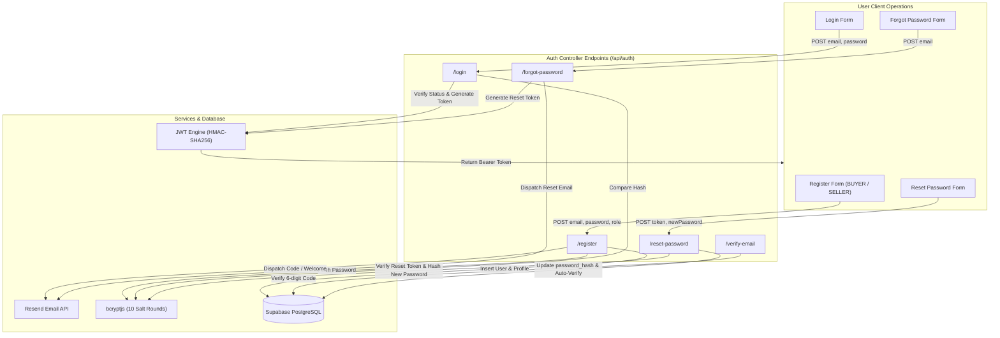
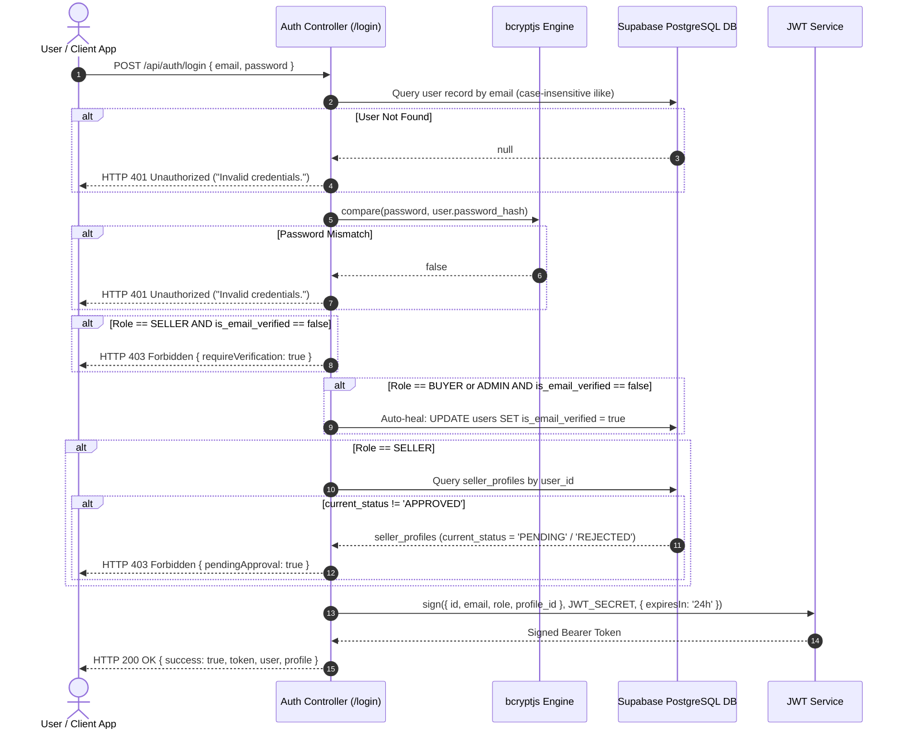
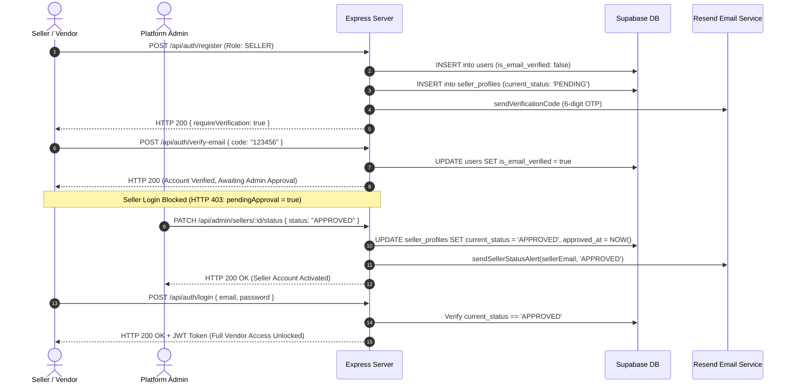
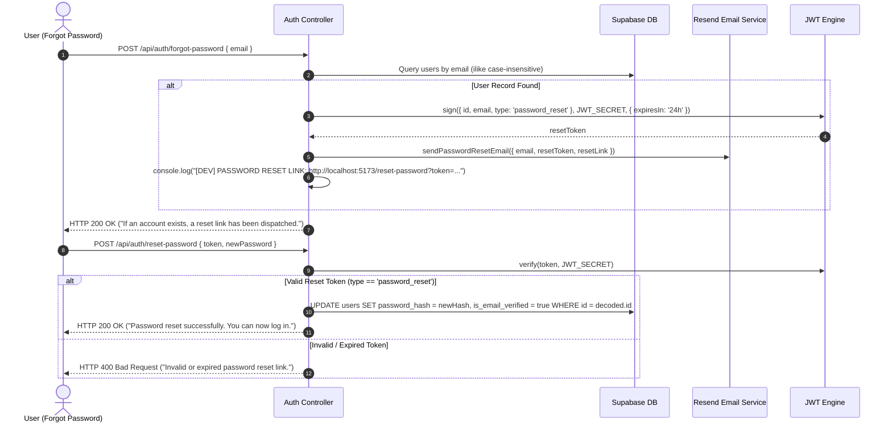

# LainDain Authentication & Authorization Documentation (MVP v1)

> **Security, Authentication & Role-Based Access Control (RBAC) Specification**  
> **Version:** 1.0.0  
> **Status:** Production / MVP v1  
> **Security Standards:** JWT Bearer Token Session Management, Salted `bcryptjs` Hashing (10 Rounds), 6-Digit Resend Email OTP Verification, Strict Role-Based Middleware Authorization  

---

## 1. Executive Summary & Security Architecture

### 1.1 Overview & Core Principles

**LainDain** enforces a robust, multi-layered security architecture designed to protect B2B wholesale transactions, confidential factory pricing, and merchant profiles.

The platform combines:
* **Stateless JWT Session Management:** Short-lived (24-hour) JSON Web Tokens signed using HMAC-SHA256 (`jsonwebtoken`).
* **Password Hardening:** Salted password hashing powered by `bcryptjs` (10 cost rounds).
* **Role-Based Access Control (RBAC):** Strict separation of privileges across four identity types (`GUEST`, `BUYER`, `SELLER`, `ADMIN`).
* **Multi-Stage Seller KYC Guard:** Wholesale sellers undergo a mandatory two-tier onboarding pipeline requiring 6-digit email OTP verification followed by administrative verification before dashboard features are unlocked.
* **Rate Limiting & Threat Mitigation:** Denial of Service (DoS) and brute-force protection enforced via `express-rate-limit`, `helmet` HTTP header security, and CORS origin filtering.

```
┌────────────────────────────────────────────────────────────────────────┐
│                          INCOMING HTTP REQUEST                         │
└───────────────────────────────────┬────────────────────────────────────┘
                                    │
                                    ▼
┌────────────────────────────────────────────────────────────────────────┐
│                 GLOBAL SECURITY & RATE LIMITING LAYER                  │
│       Helmet Headers | CORS Filter | Auth Rate Limiter (15 req/15m)      │
└───────────────────────────────────┬────────────────────────────────────┘
                                    │
                                    ▼
┌────────────────────────────────────────────────────────────────────────┐
│                   AUTHENTICATION MIDDLEWARE LAYER                      │
│                  verifyToken (Bearer JWT Validation)                   │
└───────────────────────────────────┬────────────────────────────────────┘
                                    │
                                    ▼
┌────────────────────────────────────────────────────────────────────────┐
│                  AUTHORIZATION & ROLE GUARD LAYER                      │
│         verifyBuyer | verifySeller (Status Check) | verifyAdmin        │
└───────────────────────────────────┬────────────────────────────────────┘
                                    │
                                    ▼
┌────────────────────────────────────────────────────────────────────────┐
│                    PROTECTED CONTROLLER EXECUTION                      │
└────────────────────────────────────────────────────────────────────────┘
```

---

## 2. User Roles & RBAC Permission Matrix

The system enforces strict permission boundaries across four distinct user session types:

| User Session Role | Identity Type | Onboarding & Verification Requirements | Access Scope & Endpoint Permissions |
| :--- | :--- | :--- | :--- |
| **`GUEST`** | Unauthenticated Browser | None (Auto-assigned `X-Guest-ID` client GUID) | Read-only product browsing, catalog search, guest cart management, and guest checkout execution. |
| **`BUYER`** | Retail Shop Owner | Account registration with auto-verified status (`is_email_verified = true`) | Full product search, cart operations, order placement (COD / Bank Transfer), order history tracking, and profile management. |
| **`SELLER`** | Wholesale Manufacturer | Mandatory email OTP verification + Admin KYC Review (`current_status = 'APPROVED'`) | Vendor inventory CRUD, stock level toggles, Minimum Order Quantity (MOQ) adjustments, and independent order line item fulfillment. |
| **`ADMIN`** | Platform Administrator | Administrative seed credentials or system assignment | System-wide analytics, seller application review/approval, catalog moderation, global order status override, and user directory access. |

---

## 3. Authentication Subsystems & Workflows



---

### 3.1 Account Registration & Email Verification (`/api/auth/register`)

#### 3.1.1 Registration Flow Rules
* **Buyer Registration (`role = 'BUYER'`):**
  1. Hashes raw password using `bcrypt.hash(password, 10)`.
  2. Creates a user record in `users` with `role = 'BUYER'` and `is_email_verified = true`.
  3. Instantiates an associated `buyer_profiles` record.
  4. Dispatches a general welcome email via Resend (`sendWelcomeEmail`).
  5. Generates and returns a 24-hour session JWT token immediately, giving buyers instant access to wholesale purchasing.

* **Seller Registration (`role = 'SELLER'`):**
  1. Hashes raw password using `bcrypt.hash(password, 10)`.
  2. Generates a random 6-digit numeric OTP code (`Math.floor(100000 + Math.random() * 900000)`).
  3. Creates a user record in `users` with `role = 'SELLER'`, `is_email_verified = false`, and `email_verification_token = otpCode`.
  4. Creates a `seller_profiles` record with `current_status = 'PENDING'`.
  5. Dispatches a seller welcome email and a 6-digit verification code email via Resend.
  6. **Withholds the JWT session token** and returns `{ success: true, requireVerification: true }`.

---

### 3.2 Email Verification OTP Handler (`/api/auth/verify-email`)

1. Accepts `{ email, code }`.
2. Queries `users` table matching `email` and `email_verification_token = code`.
3. If valid, updates `users`:
   ```sql
   UPDATE users 
   SET is_email_verified = true, email_verification_token = NULL 
   WHERE id = user_id;
   ```
4. For `SELLER` accounts, `seller_profiles.current_status` remains `PENDING` until approved by an Admin.
5. Issues a 24-hour session JWT token if account verification is complete.

---

### 3.3 Strict Login Security & Status Guards (`/api/auth/login`)



---

### 3.4 Seller Onboarding & KYC Approval Pipeline

To prevent unauthorized or unverified vendors from publishing products, seller accounts must complete an administrative approval workflow:



---

### 3.5 Password Reset Workflow (`/api/auth/forgot-password` & `/api/auth/reset-password`)



---

## 4. JWT Token Architecture & Specification

### 4.1 Token Structure & Claims

All JWTs issued by LainDain use HMAC-SHA256 signing with the secret key `process.env.JWT_SECRET` (fallback: `'lain-dain-jwt-secret-key-change-in-prod'`).

#### 4.1.1 Session JWT Token Payload Schema
Included in HTTP `Authorization: Bearer <token>` headers for authenticated requests:

```json
{
  "id": "6452c106-d266-4237-93ac-2878bdf7a048",
  "email": "seller@factory.com",
  "role": "SELLER",
  "profile_id": "961fd2e0-dfd6-4f4d-815c-c665bd9aa45b",
  "iat": 1786959542,
  "exp": 1787045942
}
```

* `id`: Unique user surrogate ID (`users.id`).
* `email`: User account email address.
* `role`: System authorization role (`ADMIN`, `BUYER`, `SELLER`).
* `profile_id`: Foreign key reference to the role profile (`buyer_profiles.id` or `seller_profiles.id`).
* `iat`: Issue timestamp (Unix epoch seconds).
* `exp`: Expiration timestamp (24 hours after issuance).

#### 4.1.2 Password Reset Token Payload Schema
Short-lived token dedicated exclusively to password reset verification:

```json
{
  "id": "9251d5a9-4c21-42ca-bab7-f1f92e9aadcc",
  "email": "buyer@store.com",
  "type": "password_reset",
  "iat": 1786958519,
  "exp": 1786962119
}
```

---

## 5. Authorization Middleware Specifications

### 5.1 `verifyToken` Middleware (`server/src/middleware/auth.js`)
Validates incoming bearer tokens on protected endpoints.

```javascript
const verifyToken = (req, res, next) => {
  const authHeader = req.headers.authorization || req.headers.Authorization;

  if (!authHeader || !authHeader.startsWith('Bearer ')) {
    return res.status(401).json({
      success: false,
      message: 'Access denied. No authentication token provided.',
    });
  }

  const token = authHeader.split(' ')[1];

  try {
    const decoded = jwt.verify(token, JWT_SECRET);
    req.user = decoded;
    next();
  } catch (error) {
    return res.status(403).json({
      success: false,
      message: 'Invalid or expired token.',
      error: error.message,
    });
  }
};
```

---

### 5.2 `verifySeller` Middleware (`server/src/middleware/sellerAuth.js`)
Enforces vendor role authorization AND verifies database status (`current_status === 'APPROVED'`).

```javascript
const verifySeller = async (req, res, next) => {
  try {
    if (!req.user || req.user.role !== 'SELLER') {
      return res.status(403).json({
        success: false,
        message: 'Access forbidden: Seller credentials required.',
      });
    }

    const { data: sellerProfile, error } = await supabase
      .from('seller_profiles')
      .select('id, current_status')
      .eq('user_id', req.user.id)
      .single();

    if (error || !sellerProfile || sellerProfile.current_status !== 'APPROVED') {
      return res.status(403).json({
        success: false,
        pendingApproval: true,
        message: 'Seller account pending admin approval. Access restricted until approved.',
      });
    }

    req.sellerProfile = sellerProfile;
    next();
  } catch (err) {
    console.error('Error in verifySeller middleware:', err);
    return res.status(500).json({
      success: false,
      message: 'Internal server error verifying seller status.',
    });
  }
};
```

---

### 5.3 `verifyAdmin` Middleware (`server/src/middleware/adminAuth.js`)
Restricts system metrics, approval management, and catalog override endpoints to `ADMIN` users.

```javascript
const verifyAdmin = (req, res, next) => {
  if (!req.user || req.user.role !== 'ADMIN') {
    return res.status(403).json({
      success: false,
      message: 'Access forbidden: Admin credentials required.',
    });
  }
  next();
};
```

---

## 6. Endpoint Authorization Matrix

The table below documents the exact security policies enforced across all backend REST endpoints:

| HTTP Method | API Endpoint Path | Public / Protected | Required Middleware | Authorized Roles | Failure Response |
| :--- | :--- | :--- | :--- | :--- | :--- |
| `POST` | `/api/auth/register` | Public | `authLimiter` | Anyone | `400 Bad Request` |
| `POST` | `/api/auth/verify-email` | Public | `authLimiter` | Anyone | `400 Bad Request` |
| `POST` | `/api/auth/login` | Public | `authLimiter` | Anyone | `401 Unauthorized / 403 Forbidden` |
| `POST` | `/api/auth/forgot-password` | Public | `authLimiter` | Anyone | `400 Bad Request` |
| `POST` | `/api/auth/reset-password` | Public | `authLimiter` | Anyone | `400 Bad Request` |
| `GET` | `/api/buyer/cart` | Public / Hybrid | `resolveGuestOrUser` | `GUEST`, `BUYER` | `200 OK (Empty Cart)` |
| `POST` | `/api/buyer/cart` | Public / Hybrid | `resolveGuestOrUser` | `GUEST`, `BUYER` | `400 Bad Request` |
| `POST` | `/api/buyer/checkout` | Public / Hybrid | `resolveGuestOrUser` | `GUEST`, `BUYER` | `400 Bad Request` |
| `GET` | `/api/buyer/orders` | Protected | `verifyToken` | `BUYER` | `401 Unauthorized / 403 Forbidden` |
| `GET` | `/api/seller/products` | Protected | `verifyToken, verifySeller` | `SELLER` (`APPROVED`) | `403 Forbidden (pendingApproval: true)` |
| `POST` | `/api/seller/products` | Protected | `verifyToken, verifySeller` | `SELLER` (`APPROVED`) | `403 Forbidden (pendingApproval: true)` |
| `PATCH` | `/api/seller/products/:id` | Protected | `verifyToken, verifySeller` | `SELLER` (`APPROVED`) | `403 Forbidden` |
| `GET` | `/api/seller/orders` | Protected | `verifyToken, verifySeller` | `SELLER` (`APPROVED`) | `403 Forbidden` |
| `PATCH` | `/api/seller/orders/items/:id` | Protected | `verifyToken, verifySeller` | `SELLER` (`APPROVED`) | `403 Forbidden` |
| `GET` | `/api/admin/sellers/pending` | Protected | `verifyToken, verifyAdmin` | `ADMIN` | `401 Unauthorized / 403 Forbidden` |
| `PATCH` | `/api/admin/sellers/:id/status`| Protected | `verifyToken, verifyAdmin` | `ADMIN` | `401 Unauthorized / 403 Forbidden` |
| `GET` | `/api/admin/orders` | Protected | `verifyToken, verifyAdmin` | `ADMIN` | `401 Unauthorized / 403 Forbidden` |
| `PATCH` | `/api/admin/orders/:id/status` | Protected | `verifyToken, verifyAdmin` | `ADMIN` | `401 Unauthorized / 403 Forbidden` |
| `GET` | `/api/admin/summary` | Protected | `verifyToken, verifyAdmin` | `ADMIN` | `401 Unauthorized / 403 Forbidden` |

---

## 7. Security Best Practices & Threat Safeguards

### 7.1 Attack Vector Mitigation Summary

1. **Password Hashing:** Passwords are hashed using `bcryptjs` with 10 salt rounds before storage. Plaintext passwords are never logged or persisted.
2. **Brute Force & DoS Defense:** Authentication routes (`/register`, `/login`, `/forgot-password`, `/reset-password`) use `express-rate-limit` to restrict requests to 15 attempts per 15 minutes per IP address.
3. **HTTP Header Security (`helmet`):** Configures security headers to mitigate Clickjacking (`X-Frame-Options`), Cross-Site Scripting (`X-XSS-Protection`), and MIME-type sniffing (`X-Content-Type-Options`).
4. **CORS Control:** Restricts origin access to trusted domain environments via environment configuration (`process.env.CLIENT_URL`).
5. **Token Storage Safety:** Tokens are sent using Bearer authentication and stored in client memory or local storage. In production, HTTPS enforcement prevents header interception.

---
