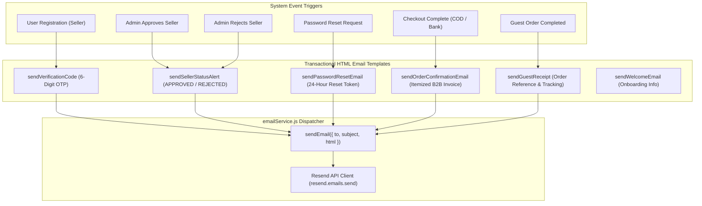

# LainDain Integrations & Third-Party Services Documentation (MVP v1)

> **Third-Party Services, External APIs & System Integrations Specification**  
> **Version:** 1.0.0  
> **Status:** Production / MVP v1  
> **Target Cloud Platforms:** Supabase (Database/Auth), Groq Cloud (Whisper STT & LLaMA 3.3 LLM), Resend (Transactional Email), Vercel (Edge CDN & Client Analytics), Render (Node.js Web Service)  
> **Resilience Architecture:** Multi-tier Fallbacks, Isolated Quotas, Circuit Breaking & Offline Local Mocks

---

## 1. Executive Summary & Integration Architecture Overview

### 1.1 Integration Philosophy & Design Principles

**LainDain** is a B2B wholesale textile marketplace built with a **decoupled, service-oriented architecture**. To deliver high availability, low latency, and rich AI-driven interactions, the platform integrates with specialized third-party cloud services.

The system adheres to five core integration principles:

1. **Graceful Degradation & Multi-Tier Fallbacks:** If an external service experiences an outage or missing credentials, the application never crashes; it falls back to alternative providers or local client-side capabilities.
2. **Quota Isolation via Independent API Keys:** Speech-to-Text (STT), Conversational AI (Rahi), and Text Chat (Laila) utilize isolated Groq API keys to prevent cross-feature rate-limiting and quota starvation.
3. **Fail-Safe Email Dispatching:** Transactional emails automatically fall back from unverified custom domains to Resend sandbox domains, and log to local console mocks during development if API keys are absent.
4. **Data Isolation & Least Privilege:** Database operations use dedicated service role keys for backend REST controllers and separate anonymous keys for client-facing read models.
5. **Zero-Dependency Analytics Resilience:** Frontend telemetry uses a resilient mock wrapper preventing client script crashes if third-party analytics scripts fail to load.

```mermaid
flowchart TB
    subgraph Client_Layer ["Client Tier (Vercel Edge Network)"]
        ReactApp["React 19 + Vite SPA"]
        RahiWidget["Rahi Voice Assistant Widget"]
        LailaChat["Laila AI Chatbot Drawer"]
        WebSpeech["Web Speech API (Browser Fallback)"]
        PostHogClient["PostHog JS Client (Telemetry)"]
        VercelAnalytics["Vercel Speed Insights & Analytics"]
    end

    subgraph API_Tier ["API Gateway Tier (Render Cloud)"]
        ExpressApp["Node.js / Express Server (server.js)"]
        
        subgraph Backend_Services
            AuthSvc["authController & authMiddleware"]
            VoiceCtrl["voiceController (STT & TTS)"]
            RahiSvc["rahiService (LLM Action Engine)"]
            ChatSvc["chatbotService (Wholesale FAQ)"]
            EmailSvc["emailService (Transactional Dispatcher)"]
            CheckoutSvc["checkoutService & cartService"]
            AdminLogistics["adminLogisticsService"]
        end
    end

    subgraph Persistence_Layer ["Database & Storage Tier (Supabase)"]
        PostgresDB[(PostgreSQL 15+ Database)]
        PrismaClient["Prisma ORM Client (Data Models)"]
        SupabaseJS["Supabase JS SDK (Service Role)"]
    end

    subgraph AI_Cloud ["AI & Speech Processing (Groq Cloud)"]
        GroqWhisper["Groq Whisper Large v3 / Turbo (STT)"]
        GroqLlamaRahi["Groq LLaMA 3.3 70B (Rahi Assistant)"]
        GroqLlamaChat["Groq LLaMA 3.3 70B (Laila Bot)"]
    end

    subgraph Speech_Synthesis ["Text-to-Speech Providers (TTS)"]
        ElevenLabs["ElevenLabs Neural TTS API"]
        GoogleTTS["Google Translate gTTS Audio Stream"]
    end

    subgraph Communication ["Email Delivery (Resend)"]
        ResendAPI["Resend REST Email API"]
    end

    %% Client to Server
    ReactApp -->|HTTP REST API / JSON| ExpressApp
    RahiWidget -->|Audio Blob Upload (multipart/form-data)| VoiceCtrl
    LailaChat -->|JSON Chat Turn Payload| ChatSvc

    %% Server to Database
    AuthSvc & CheckoutSvc & AdminLogistics --> PrismaClient
    AuthSvc & CheckoutSvc --> SupabaseJS
    PrismaClient & SupabaseJS --> PostgresDB

    %% Server to AI Cloud
    VoiceCtrl -->|Audio Buffer (toFile)| GroqWhisper
    RahiSvc -->|System Context Prompt| GroqLlamaRahi
    ChatSvc -->|Conversation Context| GroqLlamaChat

    %% Server to Speech
    VoiceCtrl -->|Primary Neural Synthesis| ElevenLabs
    VoiceCtrl -->|Secondary Audio Stream| GoogleTTS
    VoiceCtrl -.->|Tertiary Fallback Payload| WebSpeech

    %% Server to Email
    EmailSvc -->|Transactional HTML Templates| ResendAPI

    %% Client Telemetry
    ReactApp -.->|Anonymous Events| PostHogClient
    ReactApp -.->|Core Web Vitals| VercelAnalytics
```

---

### 1.2 Master Third-Party Services Inventory Matrix

| Service Name | Provider / Host | Category / Domain | Communication Protocol | Auth / Secret Key | Primary Responsibility | Fail-safe / Fallback Strategy |
| :--- | :--- | :--- | :--- | :--- | :--- | :--- |
| **Supabase PostgreSQL** | Supabase Cloud | Relational Database & BaaS | TCP Connection Pool / PostgREST HTTP | `DATABASE_URL`, `SUPABASE_SERVICE_ROLE_KEY` | Persistent storage for users, profiles, products, cart items, and multi-vendor orders. | Connection pooling with automated reconnect; local sample product catalog fallback. |
| **Groq Whisper STT** | Groq Inc. | Speech-to-Text (STT) | HTTPS REST (`groq-sdk`) | `GROQ_API_KEY_STT` | Sub-second multilingual speech transcription (Urdu, Roman Urdu, English). | HTTP 503 error payload; client switches to text input mode gracefully. |
| **Groq LLaMA 3.3 (Rahi)** | Groq Inc. | Large Language Model (LLM) | HTTPS REST (`groq-sdk`) | `GROQ_API_KEY_RAHI` | Context-aware wholesale voice navigation, intent parsing, and structured UI actions. | Predefined heuristic response and rule-based action fallback. |
| **Groq LLaMA 3.3 (Laila)** | Groq Inc. | Conversational AI (LLM) | HTTPS REST (`groq-sdk`) | `GROQ_API_KEY` | Text-based B2B customer service, MOQ inquiry, shipping policy, and seller FAQ handler. | Static wholesale knowledge base fallback responses. |
| **Google Translate gTTS** | Google LLC | Text-to-Speech (TTS) | HTTPS Stream | None (Public API Stream) | High-speed server-side audio stream synthesis for spoken assistant responses. | Switches to client-side browser `window.speechSynthesis`. |
| **ElevenLabs Neural TTS** | ElevenLabs Inc. | Text-to-Speech (TTS) | HTTPS REST API | `TTS_API_KEY` | High-fidelity neural voice synthesis for Urdu and English voice responses. | Gracefully falls back to Google gTTS or client browser synthesis. |
| **Resend API** | Resend Inc. | Transactional Email Service | HTTPS REST (`resend`) | `RESEND_API_KEY` | 6-digit OTP codes, order receipts, seller approval notices, password resets. | Auto-retries via `onboarding@resend.dev`; console mock simulation when key is missing. |
| **PostHog Analytics** | PostHog Cloud | Product Telemetry & Analytics | HTTPS REST (`posthog-js`) | `VITE_POSTHOG_KEY` | Session analytics, feature engagement, conversion funnel tracking. | Zero-dependency standalone mock wrapper (`posthog.js`) prevents crashes. |
| **Vercel Analytics** | Vercel Inc. | Performance & RUM Monitoring | HTTPS Edge Ingestion | Built-in Vercel token | Real User Monitoring (RUM), Speed Insights, Core Web Vitals tracking. | Passive edge script injection; zero impact on core runtime execution. |
| **Render Cloud Platform** | Render Services Inc. | Backend Hosting & Compute | HTTP / HTTPS Web Service | Deployment Config | Containerized Node.js API hosting, automated builds, health check monitoring. | Health check endpoint (`/api/health`) for automatic restart on crash. |

---

## 2. Database & Backend-as-a-Service Integration (Supabase PostgreSQL)

### 2.1 Service Overview & Architectural Role

LainDain utilizes **Supabase** as its cloud database provider, operating a managed PostgreSQL 15+ cluster. Supabase serves as the single source of truth for:
* User credentials and RBAC authentication states (`users`, `admin_profiles`, `buyer_profiles`, `seller_profiles`).
* Marketplace product taxonomy and multi-vendor inventory (`categories`, `products`).
* Hybrid shopping carts for both guests and authenticated buyers (`cart_items`).
* End-to-end multi-vendor purchase orders and seller line item fulfillment (`orders`, `order_items`, `guest_checkout_tracking`).

---

### 2.2 Dual Connection Paradigm: Prisma ORM vs Supabase JS SDK

The backend uses a **hybrid data access strategy** optimized for type-safety and administrative flexibility:

```
                          ┌────────────────────────┐
                          │   Express API Server   │
                          └───────────┬────────────┘
                                      │
                 ┌────────────────────┴────────────────────┐
                 │                                         │
        (Structured Models)                       (Direct CRUD / Admin)
                 ▼                                         ▼
   ┌───────────────────────────┐             ┌───────────────────────────┐
   │    Prisma ORM Client      │             │  Supabase JavaScript SDK  │
   │  (@prisma/client ^6.4.1)  │             │ (@supabase/supabase-js)   │
   └─────────────┬─────────────┘             └─────────────┬─────────────┘
                 │ (Connection Pooler)                     │ (PostgREST / Direct)
                 └────────────────────┬────────────────────┘
                                      ▼
                       ┌───────────────────────────┐
                       │  Supabase PostgreSQL DB   │
                       └───────────────────────────┘
```

1. **Prisma ORM Client (`server/prisma/schema.prisma`):**
   * Configured with `DATABASE_URL` (direct/pooled PostgreSQL URI).
   * Generates type-safe database access methods for relational entity modeling, schema validations, and transactional queries.
   * Manages foreign key cascades and relational joins across user profiles, product listings, and order line items.

2. **Supabase JavaScript SDK (`server/src/config/supabase.js`):**
   * Initialized with `SUPABASE_URL` and `SUPABASE_SERVICE_ROLE_KEY`.
   * Executes administrative queries, role-based table lookups, and fast JSON updates directly across backend controllers (`authController.js`, `sellerController.js`, `adminController.js`).

```javascript
// server/src/config/supabase.js
const { createClient } = require('@supabase/supabase-js');
require('dotenv').config();

const supabaseUrl = process.env.SUPABASE_URL;
const supabaseKey = process.env.SUPABASE_SERVICE_ROLE_KEY || process.env.SUPABASE_ANON_KEY;

if (!supabaseUrl || !supabaseKey) {
  console.warn('Warning: SUPABASE_URL or SUPABASE_SERVICE_ROLE_KEY missing in environment variables.');
}

const supabase = createClient(supabaseUrl, supabaseKey);

module.exports = supabase;
```

---

### 2.3 Credential Hierarchy & Row-Level Security (RLS) Strategy

| Key / Variable | Target Environment | Authorization Level | Security Impact & Usage |
| :--- | :--- | :--- | :--- |
| `SUPABASE_SERVICE_ROLE_KEY` | Server-Side Only (`/server`) | **Superuser / Bypass RLS** | Full read/write access to all tables. Used exclusively by Node.js controllers to perform account creations, admin approvals, stock deductions, and seller status mutations. **Never exposed to the client.** |
| `SUPABASE_ANON_KEY` | Public / Server Fallback | **Public Role** | Restricted access constrained by Row-Level Security (RLS) policies. Used as a secondary fallback if the service role key is omitted in development. |
| `DATABASE_URL` | Server-Side Only (`/server`) | **PostgreSQL Connection** | Direct connection string with pooling support used by Prisma ORM (`postgres://postgres:[PASSWORD]@[HOST]:5432/postgres?pgbouncer=true`). |
| `DIRECT_URL` | Server-Side Only (`/server`) | **Direct PostgreSQL** | Direct non-pooled connection URI used for executing schema migrations without session pooling conflicts. |

---

### 2.4 Database Automations & Schema Triggers

PostgreSQL triggers automate timestamp management across all core tables:

```sql
-- Trigger Function executed before row update
CREATE OR REPLACE FUNCTION update_updated_at_column()
RETURNS TRIGGER AS $$
BEGIN
    NEW.updated_at = NOW();
    RETURN NEW;
END;
$$ LANGUAGE 'plpgsql';

-- Active triggers on core entities
CREATE TRIGGER update_users_updated_at BEFORE UPDATE ON users FOR EACH ROW EXECUTE FUNCTION update_updated_at_column();
CREATE TRIGGER update_products_updated_at BEFORE UPDATE ON products FOR EACH ROW EXECUTE FUNCTION update_updated_at_column();
CREATE TRIGGER update_orders_updated_at BEFORE UPDATE ON orders FOR EACH ROW EXECUTE FUNCTION update_updated_at_column();
CREATE TRIGGER update_cart_items_updated_at BEFORE UPDATE ON cart_items FOR EACH ROW EXECUTE FUNCTION update_updated_at_column();
```

---

## 3. Artificial Intelligence & Speech Services Integration (Groq Cloud & TTS)

### 3.1 Groq Cloud Inference Platform

LainDain uses **Groq Cloud's Language Processing Units (LPUs)** to power low-latency conversational AI and voice transcription. Groq delivers high token generation throughput and sub-500ms audio transcription speeds.

```
                    ┌────────────────────────┐
                    │ User Voice Input (WebM)│
                    └───────────┬────────────┘
                                │
                                ▼
                    ┌────────────────────────┐
                    │ POST /api/voice/       │
                    │ transcribe             │
                    └───────────┬────────────┘
                                │ (Buffer Upload)
                                ▼
                    ┌────────────────────────┐
                    │ Groq Whisper Large v3  │
                    └───────────┬────────────┘
                                │ (Transcribed Text)
                                ▼
┌────────────────────────────────────────────────────────────┐
│                    Rahi Assistant Pipeline                 │
│                                                            │
│   Transcribed Text + Current Screen Context                │
│   (e.g., "BUYER_CATALOG", "CART_DRAWER", "SELLER_PANEL")   │
│                                                            │
│                               ▼                            │
│                  POST /api/rahi/message                    │
│                               │                            │
│                               ▼                            │
│                  Groq LLaMA 3.3 70B Engine                 │
│                               │                            │
│                               ▼                            │
│               Structured JSON Response Schema:             │
│               - "reply": Natural Language Text             │
│               - "action": Executable Frontend Command      │
│               - "suggested_actions": Shortcut Pills        │
└───────────────────────────────┬────────────────────────────┘
                                │
                                ▼
┌────────────────────────────────────────────────────────────┐
│              Multi-Tier Speech Synthesis (TTS)             │
│                                                            │
│  [Tier 1] ElevenLabs API (Neural High-Fidelity Voice)      │
│      │ (If Failed or Key Missing)                          │
│      ▼                                                     │
│  [Tier 2] Google Translate gTTS Stream (Free Cloud Stream) │
│      │ (If Failed or Network Blocked)                      │
│      ▼                                                     │
│  [Tier 3] Web Speech API (Client Browser window.speech)    │
└────────────────────────────────────────────────────────────┘
```

---

### 3.2 Speech-to-Text (STT) Integration: Groq Whisper Large v3

#### 3.2.1 Audio Processing Pipeline (`voiceController.js`)
* **Endpoint:** `POST /api/voice/transcribe`
* **Model:** `whisper-large-v3-turbo` (or `whisper-large-v3`)
* **SDK Module:** `server/src/config/groqStt.js` using `groqStt.audio.transcriptions.create()`
* **MIME Validation:** Validates incoming `multipart/form-data` uploads against allowed audio formats:
  `audio/webm`, `audio/wav`, `audio/mp3`, `audio/mpeg`, `audio/ogg`, `audio/m4a`, `audio/mp4`, `audio/x-m4a`, `audio/webm;codecs=opus`.
* **Payload Size Constraint:** 10 MB maximum audio buffer size.
* **Buffer Conversion:** Utilizes `toFile(req.file.buffer, filename)` from the `groq-sdk` package to convert in-memory binary audio blobs into compliant file streams for Groq API ingestion.

```javascript
// server/src/controllers/voiceController.js
const { toFile } = require('groq-sdk');
const { groqStt, STT_MODEL, hasSttApiKey } = require('../config/groqStt');

const transcribeAudio = async (req, res) => {
  try {
    if (!req.file) {
      return res.status(400).json({ success: false, message: 'No audio file uploaded.' });
    }

    if (!hasSttApiKey) {
      return res.status(503).json({ success: false, message: 'STT service key unavailable on server.' });
    }

    const filename = req.file.originalname || `audio_${Date.now()}.webm`;
    const fileForGroq = await toFile(req.file.buffer, filename, { type: req.file.mimetype || 'audio/webm' });

    const transcription = await groqStt.audio.transcriptions.create({
      file: fileForGroq,
      model: STT_MODEL,
      response_format: 'verbose_json',
    });

    return res.status(200).json({
      success: true,
      text: transcription.text ? transcription.text.trim() : '',
      language: transcription.language || 'en',
    });
  } catch (error) {
    console.error('Error in transcribeAudio:', error.message || error);
    return res.status(500).json({ success: false, message: 'Failed to transcribe audio utterance.' });
  }
};
```

---

### 3.3 Conversational AI Integration: Groq LLaMA 3.3 70B

#### 3.3.1 Quota Isolation Architecture
The platform isolates API access into three separate environment credentials to prevent rate-limit interference:
1. `GROQ_API_KEY_STT`: Dedicated exclusively to Whisper audio transcription.
2. `GROQ_API_KEY_RAHI`: Dedicated exclusively to the Rahi multilingual voice assistant.
3. `GROQ_API_KEY`: Dedicated to the Laila customer service chatbot.

---

#### 3.3.2 Rahi Multilingual Voice Assistant Engine (`rahiService.js`)
* **Endpoint:** `POST /api/rahi/message`
* **Model:** `llama-3.3-70b-versatile` (max tokens: `250`, temperature: `0.3`)
* **Supported Languages:** English, Urdu, and Roman Urdu.
* **Context Injection:** Ingests current client application screen state (`BUYER_CATALOG`, `PRODUCT_DETAIL`, `CART_DRAWER`, `CHECKOUT_MODAL`, `SELLER_DASHBOARD`, `ADMIN_PORTAL`).
* **Structured Action Output:** Outputs strict JSON containing natural language text alongside actionable UI directives:

```json
{
  "reply": "I have filtered the catalog for Cotton Fabric with MOQ under 50 pieces.",
  "action": {
    "type": "SEARCH_PRODUCT",
    "payload": { "query": "Cotton Fabric", "maxMoq": 50 }
  },
  "suggested_actions": [
    { "label": "View Cart", "action": "OPEN_CART" },
    { "label": "Clear Filters", "action": "RESET_CATALOG" }
  ]
}
```

---

#### 3.3.3 Laila Wholesale Customer Support Chatbot (`chatbotService.js`)
* **Endpoint:** `POST /api/chatbot/message`
* **Model:** `llama-3.3-70b-versatile` (max tokens: `400`, temperature: `0.5`)
* **Knowledge Scope:** Wholesale order minimums (MOQ), B2B credit terms, Cash on Delivery (COD) policies, vendor onboarding, and logistics tracking.
* **Input Sanitization:** User messages are sanitized and truncated to 500 characters.
* **Sliding Context Window:** Retains the last 6 conversation turns to preserve contextual continuity without exceeding token quotas.

---

### 3.4 Multi-Tier Text-to-Speech (TTS) Synthesis Pipeline

The speech synthesis layer converts assistant responses into spoken audio using a 3-tier cascade:

```
[ POST /api/voice/speak { text: "...", language: "ur" } ]
                          │
                          ▼
            [ sanitizeTextForSpeech() ]
       (Strips HTML tags & markdown symbols)
                          │
                          ▼
           [ Check: TTS_PROVIDER == 'elevenlabs' ]
                │                      │
       (Yes & Key Present)         (No / Failed)
                │                      │
                ▼                      ▼
      [ Tier 1: ElevenLabs ]    [ Tier 2: Google gTTS Stream ]
      (Neural High-Fidelity)    (https://translate.google.com/...)
                │                      │
          (If Failed)                  │ (If Stream Fails)
                │                      ▼
                └──────────────> [ Tier 3: Browser Fallback ]
                                 (JSON: { fallback: true })
                                 Client invokes window.speechSynthesis
```

#### 3.4.1 Text Sanitization Guard (`sanitizeTextForSpeech`)
Before sending text to TTS engines, the server removes markdown formatting, HTML tags, and non-pronounceable tokens to ensure clean audio output:

```javascript
function sanitizeTextForSpeech(text) {
  if (typeof text !== 'string') return '';
  return text
    .replace(/<[^>]*>?/gm, '')       // Remove HTML tags
    .replace(/[*_#`~[\]()]/g, '')    // Remove markdown formatting
    .replace(/\s+/g, ' ')            // Normalize whitespace
    .trim();
}
```

---

## 4. Transactional Email Service Integration (Resend API)

### 4.1 Service Overview & Platform Capabilities

LainDain uses **Resend** as its transactional email delivery platform. The integration manages critical lifecycle notifications for buyers, sellers, and system administrators.

* **Package Dependency:** `resend` (`^4.1.2`)
* **Service Module:** `server/src/services/emailService.js`
* **Default Sender Address:** `LainDain Support <support@laindain.org>` (with fallback to `Lain-Dain <onboarding@resend.dev>` during sandbox testing).

---

### 4.2 Automated Transactional Email Templates



---

### 4.3 Email Template Specifications

| Helper Function | Recipient Role | Trigger Event | Key Content & Action Items |
| :--- | :--- | :--- | :--- |
| `sendVerificationCode(email, code)` | `SELLER` | Seller account registration | 6-digit numeric OTP verification code with 24-hour expiration notice. |
| `sendWelcomeEmail({ email, name, role })` | `BUYER` / `SELLER` | Account registration completed | Personalized onboarding instructions and link to browse wholesale catalog. |
| `sendSellerStatusAlert(email, status)` | `SELLER` | Admin changes status to `APPROVED` or `REJECTED` | Approval congratulatory message or rejection notification with support contact details. |
| `sendPasswordResetEmail(email, resetUrl)` | All Users | Password reset request initiated | 24-hour single-use reset password button link. |
| `sendGuestReceipt(email, trackingToken)` | `GUEST` | Guest checkout order placed | Order tracking token and direct tracking link (`https://laindain.org/track/:token`). |
| `sendOrderConfirmationEmail(orderData)` | `BUYER` / `GUEST` | Checkout completed | Comprehensive HTML receipt: order number, recipient details, itemized table with quantities and unit prices, COD total, and delivery address. |

---

### 4.4 Resend Domain Resilience & Sandbox Fail-Safe

When deploying in testing environments or before custom domain DNS records (`SPF`, `DKIM`, `DMARC`) propagate, the email service automatically falls back to Resend's verified test domain:

```javascript
// server/src/services/emailService.js
let data = await resend.emails.send({ from: FROM_EMAIL, to: recipientList, subject, html });

// Fallback to onboarding@resend.dev if custom domain is unverified in testing
if (data.error && (JSON.stringify(data.error).includes('domain') || JSON.stringify(data.error).includes('not verified') || JSON.stringify(data.error).includes('forbidden'))) {
  console.log('ℹ️ [Resend Info] Custom domain unverified, retrying via onboarding@resend.dev');
  data = await resend.emails.send({ from: 'Lain-Dain <onboarding@resend.dev>', to: recipientList, subject, html });
}
```

---

### 4.5 Local Development Mock Dispatcher

If `RESEND_API_KEY` is not provided in local development, the service switches to **Mock Simulation Mode**, logging email payloads to the console without interrupting application workflows:

```
[Email Mock] Lain-Dain — Verify Your Email Address queued for seller@textiles.com - RESEND_API_KEY missing.
📬 [RESEND STATUS]: { success: true, mock: true }
```

---

## 5. Web Analytics & Telemetry Integrations (PostHog & Vercel)

### 5.1 PostHog Product Analytics Integration

* **Client Package:** `posthog-js` (`^1.417.1`)
* **Configuration Module:** `client/src/posthog.js`
* **Public Environment Variables:** `VITE_POSTHOG_KEY`, `VITE_POSTHOG_HOST`

#### 5.1.1 Resilient Standalone Mock Architecture
To ensure the client application runs smoothly in environments where PostHog is disabled, blocked by ad-blockers, or missing credentials, `posthog.js` provides a zero-dependency mock interface:

```javascript
// client/src/posthog.js
const posthogMock = {
  init: () => {},
  capture: () => {},
  identify: () => {},
  reset: () => {},
  on: () => {},
  people: {
    set: () => {},
    set_once: () => {}
  }
};

export const isPostHogEnabled = false;
export { posthogMock as posthog };
export default posthogMock;
```

---

### 5.2 Vercel Analytics & Speed Insights

The client bundle integrates `@vercel/analytics` and `@vercel/speed-insights` for real-time edge performance monitoring:
* **Core Web Vitals:** Tracks Largest Contentful Paint (LCP), Interaction to Next Paint (INP), and Cumulative Layout Shift (CLS).
* **Zero Performance Overhead:** Ingested asynchronously via Vercel's Edge Network without adding main-thread execution lag.

---

## 6. Cloud Hosting & Deployment Infrastructure

### 6.1 Vercel Edge Hosting (Frontend SPA)

The React client is deployed on **Vercel Edge Network**, configured via `client/vercel.json`:

```json
{
  "buildCommand": "npm run build",
  "outputDirectory": "dist",
  "framework": "vite",
  "rewrites": [
    {
      "source": "/(.*)",
      "destination": "/index.html"
    }
  ],
  "headers": [
    {
      "source": "/(.*)",
      "headers": [
        { "key": "Strict-Transport-Security", "value": "max-age=63072000; includeSubDomains; preload" },
        { "key": "X-Content-Type-Options", "value": "nosniff" },
        { "key": "X-Frame-Options", "value": "DENY" },
        { "key": "Referrer-Policy", "value": "strict-origin-when-cross-origin" },
        { "key": "Permissions-Policy", "value": "camera=(), microphone=(), geolocation=()" }
      ]
    }
  ]
}
```

---

### 6.2 Render Cloud Platform (Backend REST API)

The backend Express application is deployed on **Render** as a Node.js Web Service, configured via `render.yaml`:

```yaml
services:
  - type: web
    name: lain-dain-backend
    env: node
    rootDir: server
    buildCommand: npm install
    startCommand: node src/server.js
    healthCheckPath: /api/health
    envVars:
      - key: NODE_ENV
        value: production
```

* **Health Check Probe:** Render continuously polls `GET /api/health` to confirm server availability and automatically restarts unresponsive instances.

---

## 7. Integration Resilience & Graceful Degradation Matrix

The table below details how LainDain handles outages or misconfigurations across every third-party service:

| Integration Service | Failure Scenario | System Behavior & User Experience | Recovery / Mitigation Action |
| :--- | :--- | :--- | :--- |
| **Supabase Database** | Connection timeout or downtime | API returns HTTP 500. Client falls back to in-memory `SAMPLE_PRODUCTS` data for catalog browsing during demos. | Auto-reconnect pooler; check Supabase service dashboard status. |
| **Groq Whisper (STT)** | Rate limit reached or invalid API key | Voice recording modal displays helpful notice: *"Speech transcription unavailable, please use text search."* | Switch user to keyboard input; verify `GROQ_API_KEY_STT` quota. |
| **Groq LLaMA (Rahi)** | API timeout or service unavailable | Assistant falls back to rule-based keyword matching for catalog navigation commands. | Check `GROQ_API_KEY_RAHI` status; Rahi logs error and returns standard fallback text. |
| **Groq LLaMA (Laila)** | Missing key or token quota exceeded | Chatbot serves pre-cached static FAQ responses for common wholesale inquiries. | Populate `GROQ_API_KEY` in environment; verify account billing tier. |
| **ElevenLabs TTS** | API error or quota depletion | Automatically falls back to Google Translate gTTS stream without disrupting voice playback. | Check `TTS_API_KEY` balance; fallback handles audio generation. |
| **Google gTTS Stream** | Network blocked or stream failure | Endpoint returns `{ success: true, fallback: true }`; browser speaks using `window.speechSynthesis`. | Client browser provides native synthesized voice. |
| **Resend Email API** | Invalid API key or domain unverified | System falls back to sandbox sender `onboarding@resend.dev` or logs message to server console mock. | Check `RESEND_API_KEY`; verify custom domain DNS records in Resend dashboard. |
| **PostHog Analytics** | Network failure or ad-blocker active | PostHog mock silently catches calls; zero errors or console warnings surfaced to user. | Safe mock wrapper guarantees uninterrupted UI execution. |
