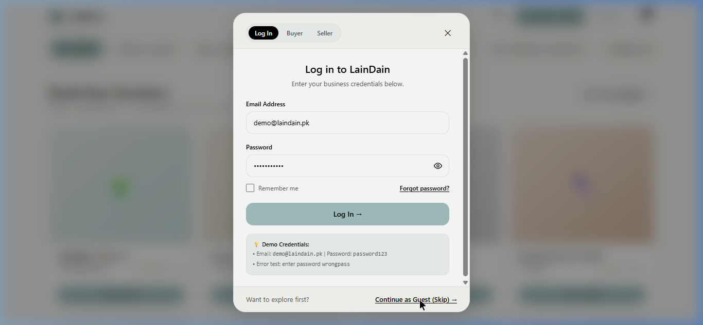
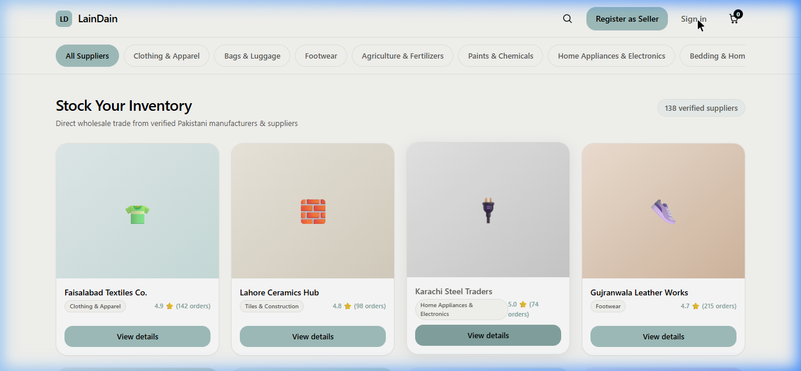
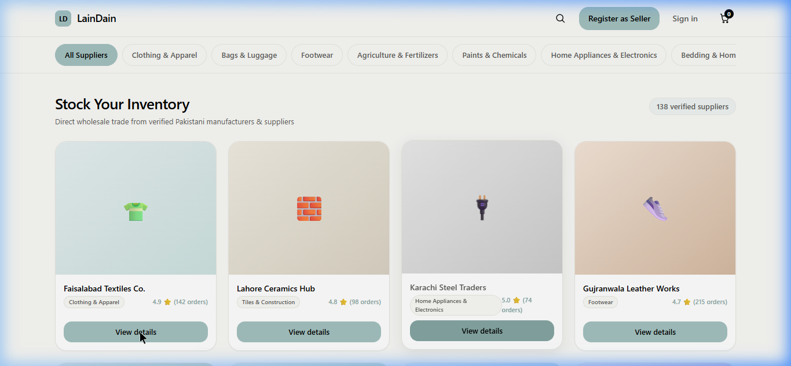

# 🛍️ LainDain (لَين دَين) — B2B Wholesale Marketplace Platform


**LainDain** is a production-grade, minimalist B2B wholesale marketplace connecting verified Pakistani manufacturers and suppliers directly with wholesale buyers and retailers. Built with a high-density, performant React + Vite frontend and a secure Node.js Express backend powered by Supabase PostgreSQL.

---

## 📸 Screenshots & Visual Tour

### 1. Wholesale Marketplace Catalog Grid
*Minimalist, compact grid layout allowing wholesale buyers to view the entire top catalog row without scrolling.*


### 2. Multi-Role Authentication & Demo Sandbox
*Modal authentication flow supporting instant guest access, buyer registration, 2-step seller onboarding, and single-click demo credentials.*


### 3. Wholesale Order & Product Details Modal
*Centralized order customization with minimum order quantity (MOQ) enforcement, color palette selection, quantity stepper, and live pricing.*


---

## ✨ Key Features & Capabilities

- 🎯 **Compact Product Grid**: Card heights optimized to `h-[110px]` with zero clutter—prices and verified tags moved to dedicated product detail views.
- ⚡ **Unified "View Details" Call-To-Action**: Every card features a single Sage Green button (`#A3C1BF`) launching an interactive wholesale modal.
- 📦 **Bulk Ordering & MOQ Logic**: Real-time quantity validation, color variant pickers, subtotal calculation, and direct "Proceed to Cart" flow.
- 🔐 **Complete Authentication System**: Supports **Buyer Registration**, **2-Step Seller Verification** (with business details & CNIC/NTN document upload), and **Forgot Password** recovery.
- 💡 **Demo Account Sandbox**: Built-in test credentials (`demo@laindain.pk` / `password123`) for instant evaluation and automated E2E testing.
- 🛠️ **Express REST API & Supabase DB**: Pre-configured endpoints for Auth JWT verification (`/api/auth`), Product CRUD (`/api/products`), and Admin operations (`/api/admin`).
- 🌐 **Production Ready Deployment**: Includes zero-config deployment manifests for **Vercel** (`client/vercel.json`) and **Render** (`render.yaml`).

---

## 📁 Monorepo Architecture

```
d:\internship\
├── .env                       # Root environment configuration (Git-ignored)
├── .gitignore                 # Enforces security for secrets & build outputs
├── package.json               # Root Workspace script runner
├── vercel.json                # Vercel Monorepo deployment rules
├── render.yaml                # Render Web Service blueprint
├── docs/                      # Centralized documentation & screenshots
│   └── screenshots/           # Platform interface screenshots
├── client/                    # 🎨 Frontend (React 19 + Vite + Tailwind CSS)
│   ├── docs/
│   │   └── design.md          # Design Tokens & UI Architecture
│   ├── public/                # Static assets & icons
│   ├── src/
│   │   ├── components/        # UI Component Library (Navbar, Card, Modals)
│   │   ├── data/              # Marketplace Mock Data & Helper Utilities
│   │   ├── App.jsx            # Main Application Controller
│   │   ├── main.jsx           # Entrypoint
│   │   └── index.css          # Design Token CSS & Tailwind Directives
│   ├── package.json           # Client Dependencies
│   └── vite.config.js         # Vite Build Configuration
└── server/                    # ⚙️ Backend API (Node.js + Express + Supabase)
    ├── docs/                  # API Specifications & SQL Schemas
    ├── src/
    │   ├── config/            # Supabase Client Initializer
    │   ├── controllers/       # Auth, Product, & Admin Controllers
    │   ├── middleware/        # JWT Auth & Security Middlewares
    │   ├── routes/            # Express API Routes
    │   ├── services/          # Email & Notification Services
    │   └── server.js          # Express Application Server
    ├── supabase/
    │   └── migrations/        # SQL Migrations for Auth & Products
    ├── Procfile               # Standard Process Runner Configuration
    └── package.json           # Server Dependencies
```

---

## 💻 Getting Started & Commands

### Prerequisites
- **Node.js**: `v18.x` or higher (`v22.x` recommended)
- **npm**: `v9.x` or higher

### Installation
Clone the repository and install dependencies:

```bash
# Clone repository
git clone https://github.com/laindaininterns/laindaindev.git
cd laindaindev

# Install root dependencies
npm install

# Install client dependencies
cd client && npm install && cd ..

# Install server dependencies
cd server && npm install && cd ..
```

---

### 🚀 Running Local Development Servers

#### **Option 1: From Project Root (`d:\internship`)**
```bash
# Start Backend Express API (Port 5000)
npm run dev:server

# Start Frontend Vite UI (Port 5173)
npm run dev:client
```

#### **Option 2: Running Client & Server Individually**
```bash
# Run Frontend UI
cd client
npm run dev

# Run Backend API Server
cd server
npm run dev
```

---

### 📦 Building for Production

To create an optimized production build of the frontend:
```bash
cd client
npm run build
```
*(Build output will be generated in `client/dist/`)*

To start the backend in production mode:
```bash
cd server
npm start
```

---

## 🔑 Environment Configuration (`.env`)

Create a `.env` file in the root directory (or `server/.env`) containing your Supabase and server configuration:

```env
# Supabase API Credentials
SUPABASE_URL=https://<your-supabase-id>.supabase.co
SUPABASE_ANON_KEY=<your-supabase-anon-key>
SUPABASE_SERVICE_ROLE_KEY=<your-supabase-service-role-key>

# PostgreSQL Direct Connection
DATABASE_URL=postgresql://postgres:<password>@db.<your-supabase-id>.supabase.co:5432/postgres

# Server Settings
PORT=5000
```

> ⚠️ **Security Notice**: Never commit `.env` files to Git. The `.gitignore` file enforces exclusion of all environment secrets.

---

## 🌐 Deployment Instructions

### 1. Deploy Frontend on **Vercel**
1. Connect your repository to **Vercel**.
2. Set **Root Directory** to `client/`.
3. Build Command: `npm run build`
4. Output Directory: `dist`
*(Vercel automatically picks up `client/vercel.json` rewrite rules for single-page routing).*

### 2. Deploy Backend on **Render**
1. Create a new **Web Service** on **Render**.
2. Connect the repository and select `server/` as the root directory.
3. Build Command: `npm install`
4. Start Command: `node src/server.js`
5. Add environment variables (`SUPABASE_URL`, `SUPABASE_SERVICE_ROLE_KEY`, `DATABASE_URL`).
*(Render automatically detects `render.yaml` and sets up health checks at `/api/health`).*

---

## 🧪 Demo Credentials

For testing authentication without creating a new account:
- **Email**: `demo@laindain.pk`
- **Password**: `password123`
- **Role & Scope**: Standard `BUYER` role (read-only catalog browsing & sandbox checkout; cannot access `/api/admin` or modify system configuration).
- **Error Testing**: Enter password `wrongpass` to view validation states.

---

## 📄 License & Ownership
Copyright © 2026 **LainDain B2B Marketplace**. All rights reserved.
