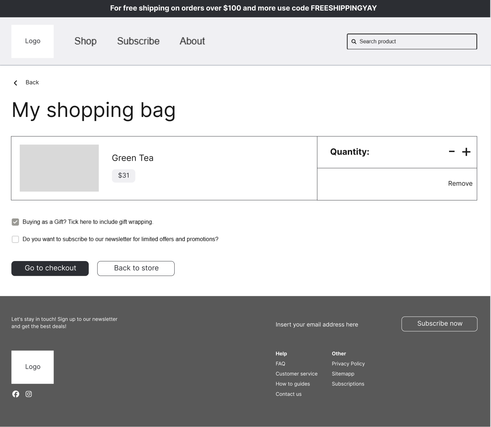
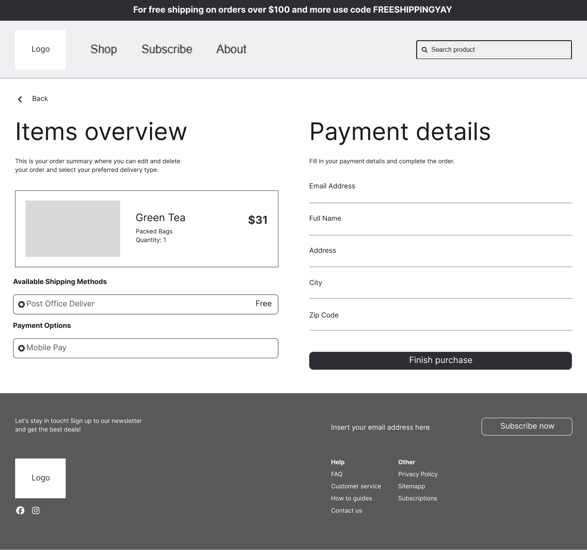

# 🍃 LainDain — B2B Wholesale Platform

A high-fidelity, interactive B2B wholesale platform built with **React**, **Vite**, **Tailwind CSS**, and **Framer Motion**. Recreated pixel-perfectly from Figma design specifications.

---

## 📌 Table of Contents

1. [Overview](#-overview)
2. [Design System &amp; Aesthetics](#-design-system--aesthetics)
3. [Page Screenshots &amp; Breakdown](#-page-screenshots--breakdown)
   - [1. Landing Page](#1-landing-page)
   - [2. Dedicated Category Catalog](#2-dedicated-category-catalog)
   - [3. Filtered Category View](#3-filtered-category-view)
   - [4. Product Description View](#4-product-description-view)
   - [5. My Shopping Bag](#5-my-shopping-bag)
   - [6. Cart Overview &amp; Payment Details](#6-cart-overview--payment-details)
4. [Component Architecture](#-component-architecture)
5. [Tech Stack](#-tech-stack)
6. [Getting Started &amp; Run Commands](#-getting-started--run-commands)

---

## 🌿 Overview

**LainDain** empowers businesses with direct wholesale sourcing and bulk procurement solutions for commercial tea and retail inventory. This application features a fully responsive, component-driven UI with cross-page state navigation, interactive filter accordions, dynamic category banners, product variant selectors, and a complete checkout pipeline.

---

## 🎨 Design System & Aesthetics

Adhering strictly to brand guidelines:

- **Typography**: `Poppins` (via Google Fonts)
- **Color Palette**:
  - `Ash Grey`: `#A3C1BF` (Primary accent & badge highlights)
  - `Snow`: `#FDF9F6` (Main page background tone)
  - `Black`: `#000000` / `#262B2E` (Borders, typography, and primary CTA buttons)

---

## 📸 Page Screenshots & Breakdown

### 1. Landing Page

The home view introduces LainDain with hero banners, category navigation, featured products, subscription callouts, and bestseller carousels.


- **Key Highlights**:
  - Reusable `Navbar` with promo shipping banner and search.
  - Hero split banner with CTA buttons.
  - Category showcase cards (`Tea`, `Coffee`, etc.).
  - "Just In" product spotlight.
  - Subscription banner & "Try our bestsellers" carousel.

---

### 2. Dedicated Category Catalog

The full catalog overview page presenting product listings, category cards, and wholesale offerings.


- **Key Highlights**:
  - Header split banner with visual placeholder.
  - Category selector grid.
  - Full catalog 4-column product grid.

---

### 3. Filtered Category View

A specialized category browsing experience featuring dynamic headers and interactive sidebar filters.


- **Key Highlights**:
  - **Dynamic Title Header**: Displays stacked category titles (e.g. `Green tea Selection`).
  - **Category Pills**: Quick filtering buttons (`Black Tea`, `Green tea`, `Rooibos tea`, `White tea`).
  - **Interactive Accordion Sidebar**: Boxed filters for `Tea type`, `Size`, `Strength`, `Caffeine`, and `Source`.

---

### 4. Product Description View

An in-depth detail page for individual product items with variant controls and recommendations.


- **Key Highlights**:
  - Breadcrumb navigation (`Home > All products > Green Tea`).
  - Star ratings, review count badges, and rich product description copy.
  - Packaging variant toggles (`Loose leaf tea` vs. `Tea bags`).
  - Quantity counter stepper & dynamic price badge (`$31`).
  - `Add to bag` action button.
  - "Shop similar" recommendation grid.

---

### 5. My Shopping Bag

The shopping bag view providing item summary, quantity updates, and checkout preparation.



- **Key Highlights**:
  - `< Back` link.
  - Outlined item summary card with image placeholder, item title (`Green Tea`), price badge (`$31`), quantity counter (`- 1 +`), and `Remove` option.
  - Gift wrapping checkbox and newsletter subscription toggle.
  - CTA action buttons: `Go to checkout` & `Back to store`.

---

### 6. Cart Overview & Payment Details

The final order review and checkout step with delivery options and payment form.



- **Key Highlights**:
  - **Items Overview (Left)**: Order summary card, `Available Shipping Methods` radio option (`Post Office Deliver`), and `Payment Options` (`Mobile Pay`).
  - **Payment Details (Right)**: Form fields with clean line borders (`Email Address`, `Full Name`, `Address`, `City`, `Zip Code`).
  - `Finish purchase` button with order confirmation popup modal.

---

## 🏗 Component Architecture

```text
src/
├── components/
│   ├── Navbar.jsx               # Navigation bar with search & shopping bag badge
│   ├── Hero.jsx                 # Landing page hero split section
│   ├── CategorySection.jsx      # Category cards grid
│   ├── JustInSection.jsx        # Featured item banner
│   ├── SubscriptionSection.jsx  # Subscription callout box
│   ├── BestsellersSection.jsx   # Product carousel section
│   ├── ProductCard.jsx          # Reusable product card component
│   ├── CategoryPage.jsx         # Category catalog & filter accordion view
│   ├── ProductDetailPage.jsx    # Product description & variant selector view
│   ├── ShoppingBagPage.jsx      # Shopping bag item summary & controls
│   ├── CartOverviewPage.jsx     # Checkout summary & payment details form
│   └── Footer.jsx               # Shared application footer
├── App.jsx                      # Main app layout & page router state
├── main.jsx                     # Application entry point
└── index.css                    # Global Tailwind CSS & font imports
```

---

## ⚡ Tech Stack

- **Framework**: React (v19) + Vite
- **Styling**: Tailwind CSS (v4) + Custom CSS
- **Animations**: Framer Motion
- **Icons**: Lucide React
- **Typography**: Poppins Font

---

## 🚀 Getting Started & Run Commands

Follow these steps to set up and run the project locally:

### 1. Prerequisites

Ensure you have **Node.js** (v18 or higher) and **npm** installed on your system.

### 2. Clone the Repository

```bash
git clone https://github.com/laindaininterns/laindaindev.git
cd internship
```

### 3. Switch to Working Branch

```bash
git checkout akif/demoUIPage01
```

### 4. Install Dependencies

```bash
npm install
```

### 5. Start Development Server

```bash
npm run dev
```

The application will start locally at **`http://localhost:5173`**.

### 6. Build for Production

```bash
npm run build
```

### 7. Preview Production Build

```bash
npm run preview
```

---

## 📝 Commit & Push Changes

```bash
git add .
git commit -m "update README.md with detailed visual specs and run commands"
git push origin akif/demoUIPage01
```
