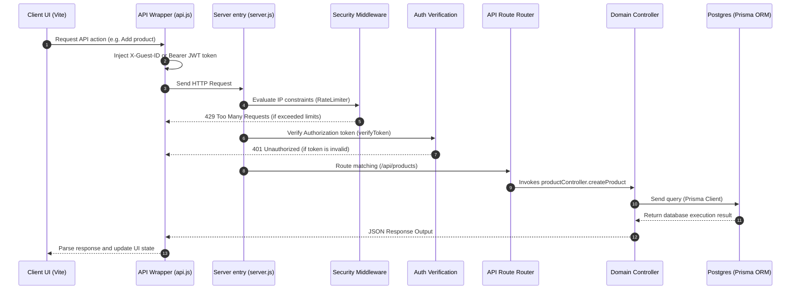

# LainDain Project Structure & Codebase Guide (MVP v1)

> **Project Structure and Codebase Guide**  
> **Version:** 1.0.0  
> **Status:** MVP v1  

---

## 1. Monorepo Organization Overview

LainDain is structured as a monorepo split into two primary applications: a React single-page application under `/client` and a Node.js Express REST API under `/server`. Root-level configurations manage deployment orchestration and repository-wide dependency definition.

```
laindaindev/
├── client/                 # React Single Page Application (Vite-powered)
├── server/                 # Node.js / Express REST API (Prisma/PostgreSQL)
├── docs/                   # System Documentation & Handbooks
├── .gitignore              # Monorepo-wide Git exclusion rules
├── package.json            # Monorepo task runner & script definitions
├── render.yaml             # Render Blueprint configuration for backend deployment
└── vercel.json             # Vercel deployment configuration for frontend redirection
```

---

## 2. Monorepo Root Directory Configuration

The root contains configuration files to simplify deployment and script routing across both environments.

### 2.1 Workspace Configuration (`package.json`)
The root `package.json` coordinates developmental starting scripts, allowing engineers to bootstrap both frontend and backend configurations concurrently or independently:
* `npm run dev`: Bootstraps the development workflow.
* `npm run build`: Orchestrates static builds for the production environments.

### 2.2 Infrastructure Blueprints
* **`render.yaml`**: Standardizes the infrastructure deployment of the backend web service on Render, mapping environment dependencies, start commands (`node server/src/server.js`), and resource specifications.
* **`vercel.json`**: Implements global rewrites for the client, directing all wildcard URI matching to `/index.html` to allow the React SPA to process path routing client-side without receiving `404 Not Found` errors from edge nodes.

---

## 3. Frontend Codebase Architecture (`/client`)

The client architecture is modular, relying on a unified styling theme and component hierarchy optimized for fast initial rendering, in-memory caching, and context-dependent UI interactions.

### 3.1 Client Directory Structure
```
client/
├── public/                 # Static assets (favicons, logos)
├── src/
│   ├── assets/             # Images, graphics, and local media resources
│   ├── components/         # Reusable React components and specialized subfolders
│   │   ├── admin/          # Admin-only dashboard page panels
│   │   ├── admin-dashboard/# Layout modules specific to the Admin Portal
│   │   ├── auth/           # Verification modal and registration screens
│   │   ├── chatbot/        # Laila AI chatbot user interface elements
│   │   ├── rahi/           # Rahi floating voice assistant widget
│   │   ├── seller/         # Seller dashboard tabs (KYC, products, orders)
│   │   ├── seller-dashboard/# Layout modules specific to the Seller Portal
│   │   ├── CartDrawer.jsx  # Slid-out shopping cart component
│   │   ├── CategoryBar.jsx # Horizontal category navigation listing
│   │   ├── CheckoutModal.jsx # Order execution panel (COD/Bank Transfer)
│   │   ├── Navbar.jsx      # Navigation header with search and user management
│   │   ├── NotFoundPage.jsx# Custom fallback route for invalid links
│   │   ├── ProductCard.jsx # Single catalog product grid display
│   │   ├── ProductDetailModal.jsx # Detail specifications modal
│   │   └── Toast.jsx       # Custom micro-notification system
│   ├── data/               # Static dataset mockups (sample products fallback)
│   ├── pages/              # Primary route-level dashboards
│   │   └── admin-dashboard/# Consolidated viewports for Admin functions
│   ├── services/           # Network utilities and external API wrappers
│   │   └── api.js          # Centralized Fetch wrapper with apiCache middleware
│   ├── App.css             # Main component level styling rules
│   ├── App.jsx             # Main state coordinator & UI layout orchestrator
│   ├── index.css           # Global design system, utility rules, and style tokens
│   ├── main.jsx            # DOM registration point for React
│   └── posthog.js          # Analytical user tracking setup (if active)
├── .env.example            # Environment variables template for client config
├── index.html              # Core single-page HTML skeleton
└── vite.config.js          # Vite compilation and bundler configuration
```

### 3.2 Client Configuration Detail
* **[`index.html`](file:///e:/laindaindev/client/index.html)**: Houses the single root target (`<div id="root">`) where Vite attaches the React application. It loads Google Fonts (Inter, Outfit) and configures the default viewport.
* **[`vite.config.js`](file:///e:/laindaindev/client/vite.config.js)**: Configures CSS optimizations, manages hot module replacement parameters, and maps server proxy variables to ensure local API routing matches production pathways.
* **[`src/services/api.js`](file:///e:/laindaindev/client/src/services/api.js)**: Establishes a fetch wrapper implementing:
  * Injection of `Authorization: Bearer <JWT>` headers when tokens exist in local storage.
  * Auto-generation and retention of the `laindain_guest_id` in `localStorage`, forwarding it in the `X-Guest-ID` header.
  * In-memory request caching (`apiCache`) with manual invalidation routines on data mutate.

---

## 4. Backend Codebase Architecture (`/server`)

The server codebase is designed as an Express REST API leveraging Prisma ORM to communicate with a PostgreSQL instance. The logic uses controller-based separation of concerns, routing tables, and explicit security middleware.

### 4.1 Server Directory Structure
```
server/
├── prisma/
│   ├── migrations/         # Database migration history files (SQL format)
│   ├── schema.prisma       # Primary Prisma schema modeling tables and relations
│   └── seed.js             # Seed script for bootstrapping categories and initial configurations
├── src/
│   ├── config/             # Connection configurations (DB clients, SDK setups)
│   │   ├── db.js           # Prisma Client initialization instance
│   │   └── supabase.js     # Supabase client wrapper for storage/auth (if needed)
│   ├── controllers/        # Business logic controllers separating system roles
│   │   ├── adminController.js # Admin summary, sellers approvals, buyer statistics
│   │   ├── adminLogisticsController.js # Admin logistics and shipping overrides
│   │   ├── authController.js  # Identity registration, verification, and logins
│   │   ├── buyerController.js # Buyer profile, cart, and checkout execution
│   │   ├── chatbotController.js # Customer support chat processing
│   │   ├── productController.js # Catalog listings, search, and CRUD methods
│   │   ├── rahiController.js  # Voice assistant processing backend
│   │   ├── sellerController.js # Seller KYC updates and inventory management
│   │   ├── sellerOrderController.js # Order processing from the seller perspective
│   │   └── voiceController.js # Speech-to-text and text-to-speech services
│   ├── data/               # Local static templates or data files
│   ├── middleware/         # Custom request interceptors and security filters
│   │   ├── auth.js         # JWT validation and RBAC enforcement (verifyToken, etc.)
│   │   └── rateLimiter.js  # API request limit profiles
│   ├── routes/             # Network route mapping files
│   │   ├── adminRoutes.js  # Admin panel access routes
│   │   ├── authRoutes.js   # Authorization operations endpoints
│   │   ├── buyerRoutes.js  # Buyer profile, cart, and checkout routes
│   │   ├── chatbotRoutes.js# Laila chatbot endpoint
│   │   ├── productRoutes.js# Public and protected catalog endpoints
│   │   ├── rahiRoutes.js   # Rahi AI voice processor router
│   │   ├── sellerRoutes.js # Seller-specific dashboard endpoints
│   │   └── voiceRoutes.js  # Voice transcription and synthesis endpoints
│   ├── services/           # Third-party integrations and service wrappers
│   │   ├── chatbotService.js # Laila chatbot LLM integration wrapper
│   │   ├── emailService.js # Resend transactional email configurations
│   │   └── rahiService.js  # Rahi voice assistant AI context parser
│   └── server.js           # Express main server initialization and route registration
├── supabase/               # Raw migration files and system database schema plans
├── .env.example            # Environment variables template for server configuration
├── Procfile                # Heroku/Render process declaration file
└── package.json            # Server-specific dependencies and run script mappings
```

### 4.2 Database Modeling Workflow (Prisma ORM)
Prisma is the core database interface tool. The database configuration cycle is detailed as:
1. **Schema Definition**: [`prisma/schema.prisma`](file:///e:/laindaindev/server/prisma/schema.prisma) defines the models, mappings, and relationships using the Prisma Schema Language.
2. **Migrations**: Applied via Prisma Migrate commands:
   * Local update: `npx prisma migrate dev --name <migration_name>`
   * Remote production sync: `npx prisma migrate deploy`
3. **Database Client generation**: Prisma automatically generates a type-safe client stored in `node_modules/.prisma/client`, which is exported for controllers through [`src/config/db.js`](file:///e:/laindaindev/server/src/config/db.js).

---

## 5. Architectural Communication Flow

The interaction between client and server is organized through RESTful routes, validated by middleware layers, and resolved via controller business logic.



---

## 6. Development Standards & Conventions

To maintain codebase health, consistency, and readability, all developers must adhere to the following standards.

### 6.1 Coding Style & Naming Conventions
* **React Components**: Created in `.jsx` using PascalCase for filenames and components (e.g., `ProductDetailModal.jsx`).
* **JavaScript files**: Created using camelCase for controllers, middleware, routes, and services (e.g., `authController.js`).
* **SQL & Migrations**: Written in lowercase snake_case (e.g., `01_auth_system.sql`).
* **Environment Configuration**: Always documented in `.env.example`. Secrets are never committed to version control.

### 6.2 Routing Pattern and Middleware Chaining
Each domain namespace routes requests through a specific sequence of middlewares in their route declarations:

```javascript
// Example Route Declaration (src/routes/sellerRoutes.js)
router.post(
  '/products',
  verifyToken,     // 1. Verify Authentication & Extract user payload
  sellerAuth,      // 2. Enforce role-based access control (must be SELLER)
  createProduct    // 3. Execute controller logic
);
```

### 6.3 Global Error Handling Pattern
The server implements a centralized JSON error response schema. Inside controllers, operations are wrapped in `try/catch` blocks, passing errors to the express pipeline or returning structured errors directly:

```javascript
// Typical Response JSON schema for Success
res.status(200).json({
  success: true,
  data: resultPayload
});

// Typical Response JSON schema for Failures
res.status(400).json({
  success: false,
  error: "Error message explaining specific action failure"
});
```

All unhandled exceptions caught in the Express main thread are captured and converted into clean 500 server errors by a global catch middleware at the end of [`server.js`](file:///e:/laindaindev/server/src/server.js).
